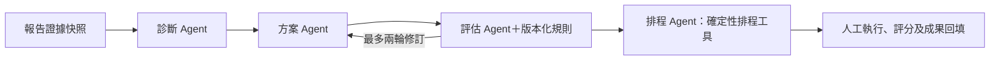

# 決策升級：使用、設計與驗證

## 已實作

保留本機 FastAPI、SQLite 與原來源邊界。建立任務時可勾選自動規劃；這也代表蒐集停止後接受目前部分資料並自動接續分析。未勾選時仍先確認資料再分析。沒有定期抓取或外部派工。

報告提供週／月趨勢、語意抱怨主題、問題證據、改善工作、AI／規則評估與真人評估。品牌比較頁由首頁或報告進入。規劃期間使用獨立 SSE，不受既有分析任務完成影響。

## 安裝與升級

先關閉本機應用程式並備份 SQLite 資料庫，再執行：

```powershell
uv sync --no-editable --reinstall-package simpsons-insight-agent
uv run --no-sync alembic upgrade head
uv run --no-sync simpsons-insight-agent
```

migration `0005_decision` 是加法升級，不重寫既有報告。新增 `topic_versions`、`decision_plans`、`agent_runs`、`improvement_tasks`、`plan_evaluations`、`brand_comparisons`，以及任務自動規劃設定、分析結果的 `negative_aspects`。刪除原任務會連帶刪除其報告、主題與決策；比較集合保留並提示缺少報告。

## 趨勢與主題規則

- V3 報告保存遮罩文字、情緒、來源、日期精度與主題鍵的快照，證據回查直接使用該快照；後續蒐集不改變歷史內容。舊報告照常讀取，未主動回填主題。
- 台北 UTC+8、週一起算；週桶接受 day／week，月桶接受 day／week／month。較粗或未知日期不纳入，顯示排除筆數；已知但不在查詢期間的資料不計為精度排除。相對日期仍屬估計。
- 聲量逐筆等權、同 ID 去重；負評比例以 positive／neutral／negative 文字分類數為分母，僅星等及未知分類不納入分母。零分母顯示無資料。
- 主題涵蓋負面文字與明確負面面向，包括整體正面但含抱怨者。重用本地 embeddings，正規化向量、centroid 相似度 ≥0.80 合群。單筆主題標為暫定；缺少向量明確標記 partial。
- 主題名稱與關鍵詞優先取面向重點，沒有雲端重點時取原文片段；不另下載模型。跨次只對應同品牌、同模型的上一份報告；相似度 ≥0.90 且高於次佳至少 0.05 才沿用 topic_key，否則標示新主題。保存 centroid 與算法版本 `centroid-v1`。
- 品牌比較使用相同查詢期間；來源占比、實際可見期間或完整度不同時提示限制。共同抱怨以固定面向作基線，語意主題並列呈現；不假裝不同品牌的 topic_key 可直接對等，也不推定市場占有率。

## 決策工作流與限制



前三個角色使用不同結構化輸出與提示詞，排程角色以確定性工具保證相依與工時規則。協調器依评估結果決定修訂或交由人工，無無限 Agent 對話。最多選取 60 筆抱怨、每筆 800 字；畫面／紀錄保留覆蓋數量限制。引用送模型前轉為短匿名鍵，回傳後驗證並映回本機 ID。無效引用不得成為公開改善工作。

每階段最長 120 秒、整次執行最多 600 秒；方案最多 15 項、最多初稿加兩轮修訂；單階段最多三次嘗試。完成階段持久化，不因重試重複呼叫。停機後重排 PENDING／RUNNING 計畫；使用者取消可中止模型等待。手動重試仅針對 PARTIAL／CANCELED；既有工作與回填不被覆寫。

`practicality-v1` 檢查引用、角色／成本／步驟／目標、相依圖與評估分數。每項 1–5 分，至少 3 分且沒有待修訂要求才通過。未知根因、前置條件或資源假設均需人工確認。根因描述為假設，不代表因果已成立。

排程以共享每週工時池循序分配，先滿足依賴再依 priority 排序；每天平均分配週工時，使用日曆日而非工作日，不包含人員休假／班表。日期與週工時齊全才產生日期；缺一時只給相對草案，未填週工時暫以 5 小時估計並明示。人工改日期會標記為 manual，檢查前後與依賴順序，容量需人工重新確認。

狀態：PENDING → RUNNING → COMPLETED／NEEDS_REVIEW／PARTIAL／CANCELED。沒有金鑰或模型失敗保留統計，無負面證據不生成假方案。執行紀錄含輸入、結構化輸出、工具名稱、耗時、嘗試次數、錯誤種類與可得 token 使用量；沒有價格資訊時成本為 null，不能解讀成免費。人工評估獨立追加，不覆蓋 AI 評分。

## API

| 功能 | API |
| --- | --- |
| 週／月趨勢 | `GET /api/reports/{id}/trends?interval=week|month&date_from=YYYY-MM-DD&date_to=YYYY-MM-DD&source=ptt&topic_key=...` |
| 主題／快照證據 | `GET /api/reports/{id}/topics`、`GET /api/reports/{id}/evidence/{item_id}` |
| 啟動／查看規劃 | `POST /api/reports/{id}/decisions`、`GET /api/reports/{id}/decisions` |
| 狀態／進度／紀錄 | `GET /api/decisions/{id}`、`GET /api/decisions/{id}/events`、`GET /api/decisions/{id}/audit` |
| 取消／續跑 | `POST /api/decisions/{id}/cancel`、`POST /api/decisions/{id}/retry` |
| 編輯工作 | `PATCH /api/improvement-tasks/{id}` |
| 人工評估 | `POST /api/decisions/{id}/evaluations` |
| 選擇報告／品牌比較 | `GET /api/insights/reports`、`POST /api/comparisons`、`GET /api/comparisons/{id}` |
| 前後觀察 | `GET /api/decisions/{id}/outcomes?after_report_id=...&intervention_date=YYYY-MM-DD` |

建立任務 body 可增加 `auto_plan: true` 及 `planning_options`。啟動規劃 body 直接使用同一設定：`{"start_date":"2026-09-07","weekly_hours":10,"constraints":"只有店長可投入"}`。同一報告重複啟動回傳同一計畫，不覆盖設定或工作。前後觀察限同品牌、介入日前後各 28 日，只呈現樣本變化。

## 示範與評估

固定資料 `tests/fixtures/decision/synthetic_reviews.json` 為專案自寫 CC0 合成評論。種子腳本拒絕覆寫既有資料庫；示範情緒標籤與人工向量僅驗證 UI、流程，不能驗證模型準確率。

```powershell
uv run --no-sync python scripts/seed_decision_demo.py --database data/decision-demo.db
$env:DATABASE_URL = 'sqlite+aiosqlite:///D:/simpsons-insight-agent/data/decision-demo.db'
uv run --no-sync simpsons-insight-agent
```

離線準備基準輸出與評分範本：

```powershell
uv run --no-sync python scripts/evaluate_decisions.py --manifest data/decision-demo.json --output data/evaluation-offline
```

實際模型比較使用同一證據與資源限制，需加 `--live`；會呼叫模型並在示範資料庫建立獨立分析計畫。可提供 `--input-usd-per-million`、`--output-usd-per-million` 計算已知 token 的費用估計，不自動假定價格。每次指定新的輸出資料夾。

比較方法為目前確定性摘要、單 Agent 一次產出、多 Agent 協作。`reviewer/` 只含匿名輸出、證據與評分 CSV，`researcher.json` 保存方法對照、模型、fixture hash、耗時、token、費用與執行狀態，先不提供給評估者。格式可能透露方法，因此不是嚴格雙盲。

請至少三位評估者獨立評證據支持、具體性與可行性（1–5），先鎖定評分再解盲；報告平均分、分歧與成本／耗時。離線執行不產生假的模型輸出；OpView 試用及真人評估目前**尚未完成**，本次未實際呼叫付費模型。流程測試使用 mock。

品質檢查：`pytest`、`ruff check .`、`mypy src/simpsons_insight_agent`。新增測試涵蓋精度排除、零分母、去重、主題對應、資源排程、引用拒絕、修訂上限、取消與續跑、人工回填、跨品牌限制及舊報告不重寫。
