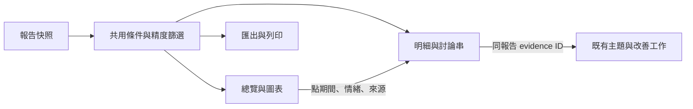

# 店家／品牌分析介面詳細規格

版本：設計草案 1，2026-09-07。**本文件保留原始設計規格；M1～M5已實作，實際API、操作與驗證見[營運分析文件](operational-analytics.md)。** 證據見 [桌面截圖參考](opview-ui-reference.md)，階段與現況見 [功能差距](opview-gap-analysis.md)。保留 FastAPI、SQLite、Jinja2、原生 JavaScript 與目前三平台來源邊界。

## 1. 由截圖得到的設計決策

| 實際觀察 | 本系統採取的設計決策 |
| --- | --- |
| 日期／來源變更後出現重新查詢，舊圖仍保留 | 分開保存草稿條件與已套用條件；有修改時顯示「條件尚未套用」，匯出只使用已套用版本 |
| 固定頁首、左側模組導覽、區段式報表 | 保留現有品牌風格，報告加固定條件列與區段導覽，不照抄 OpView 配色或商標 |
| 日圖搭配週／月折疊區，長頁面容易失去位置 | 同一趨勢區改用日／週／月切換；目前粒度同步傳給明細與匯出 |
| 單主題與多主題的圖形及模組不同；需另外選中兩個主題 | 沿用目前報告選擇器，明示已選品牌數；少於兩個時停用比較按鈕並就地說明 |
| 多主題增加社群競爭力矩陣 | 本地資料不是全網母體，不提供「市場占有率」標籤；本期以同步趨勢及共同面向為主，矩陣另列後續提案 |
| 文字雲說明將範圍限定於熱門文章 | 本系統改用已套用篩選後的全部文字快照，顯示實際納入筆數；明確區別熱門文章子集 |
| 討論串彈窗顯示主文、回應，每頁50筆，可切第二頁 | 建立可鍵盤操作的證據抽屜，沿用本機匿名化；每頁25筆以符合現有明細預設，不呈現作者 |
| 查詢中切換多主題會被阻止；明細查詢可能久候 | 每區明示 loading／ready／empty／partial／error；取消前一請求，保留其他已載入區段 |
| 圖表提供 PNG／JPEG；數據下載產生 xlsx 名稱 | 首版重用既有 CSV／JSON，加趨勢 CSV 與列印 HTML；不為對齊競品增加 XLSX 依賴 |

以上右欄均為本系統設計，並非推定 OpView 內部實作。

## 2. 頁面與狀態流程

報告頁由「條件列 → 總覽 → 趨勢／情緒 → 來源與頻道 → 主題／關鍵詞 → 熱門討論串 → 改善工作」組成。已有問答、星等、固定面向與來源蒐集狀態保留。

- `draftFilters` 為輸入中的条件；按「套用」驗證成功後才更新 `appliedFilters`。從圖表下鑽建立 `drilldownFilters`，不改寫已套用的整份報告條件。
- 已套用條件序列化至報告頁 query string，可重新整理還原；不建立公開分享資源。不將帳號或私有文字放進外部 URL。
- 所有區段顯示同一 `scope_key`。前端以遞增 request ID 及 AbortController 忽略舊回應；載入中保留舊圖，但標「更新中」並停用該範圍匯出。
- 點折線點／長條／表格列開證據抽屜；鍵盤 Enter／Space 同樣可用。抽屜顯示條件籤、納入／排除數、分頁及返回，Escape 關閉並回復焦點。
- 圖例只控制序列可見性，不改變總數與匯出範圍；真正篩選使用明確的條件列或「查看此來源」按鈕，避免混淆。
- 族群不新增推估功能；可用來源／看板資料回答「在哪裡討論」。新手範例沿用本地合成資料，清楚標記示範。

## 3. P0：版本化快照與共用查詢

### 資料版本與相容

新報告使用 `schema_version: 4`，保留現有 payload 欄位，擴充 `analytics_items`。不需要新增關聯表；版本與資料存於既有 JSON payload，無需為本變更單獨建立 migration。

每筆快照保存現有情緒、面向、主題鍵及下列欄位：`id`、`source`、`content_type`、`title`、`text`、`board`、`thread_source_id`、`parent_source_id`、`source_url`、`published_at`、`date_precision`、`rating`、`relative_date`、`owner_reply`、`language`、`confidence`、`rating_sentiment`、`rating_text_conflict`、`key_points`、`metrics`、`channel_label`。`metrics` 僅白名單保存目前來源實際提供的回應／reaction計數；不直接複製任意 `platform_data`。缺資料存 null，不存虛構零值。

- 標題、正文、店家回覆與關鍵重點經现有遮罩。作者原文與作者雜湊不加入快照或匯出；URL 只保留可安全開啟的 http(s) 來源連結，不傳模型。
- Google 的 `channel_label` 為當次報告商家名稱；PTT／Dcard 為看板。相同文字在不同来源不合併，內容 ID 去重沿用現行邏輯。
- V4 從快照提供圖表、明細、單筆證據、CSV／JSON。JSON 的 `items` 與相容別名 `reviews` 返回同一批篩選結果。
- V3 已有快照時只用快照，缺欄位回 null／空集合並以 `unavailable_fields` 說明，不回填目前 Review 表。`ReviewResponse` 既有必填但可空欄位仍輸出 null，欄位名稱不移除。
- V1／V2 無快照時維持現有資料表讀取，回 `data_basis: legacy_live` 與警示；不宣稱不可變。所有視圖共用該次解析結果與篩選函式。歷史內容不可復原；需要不可變報告者重新建立新報告，不原地升級。
- 新版 `data_basis` 為 `snapshot`，帶 `snapshot_version`。刪除任務／報告沿用既有連帶刪除規則，不增設隱藏副本。

### 共用條件契約

建立 Pydantic `ReportFilters` 供所有新分析與既有明細／匯出使用：

| 欄位 | 規格 |
| --- | --- |
| `date_from`, `date_to` | 可選 ISO 日期，含首尾日；前者不可晚於後者；使用 Asia/Taipei |
| `interval` | `day|week|month`，預設 month；圖表、下鑽與趨勢匯出共用 |
| `precision_policy` | `all|interval`；一般明細預設 all，圖表及其下鑽强制 interval |
| `source`, `content_type`, `sentiment` | 可選既有來源／內容類型與情緒值；rating_only、unknown 可供明細篩選 |
| `aspect`, `topic_key`, `board`, `thread_source_id` | 可選精確匹配；`board` 與串鍵搭配來源使用，避免跨來源同名混淆 |
| `q`, `rating`, `review_id` | 保留既有語義與限制；q 在遮罩文字中作字面搜尋 |
| `any_terms`, `all_terms`, `exclude_terms` | 重複 query 參數，每組最多20詞，每詞1–100字；trim、去重，空字串拒絕；UI 移除空籤 |

條件群之間 AND；任一詞組內 OR；必須詞全數符合；排除詞任一命中即排除。新增詞組比對遮罩標題＋正文，使用 Unicode NFKC 及 casefold，**不接受正規表示式或任意布林程式碼**。不改寫原文；不自行繁簡轉換。非法條件回 422，錯誤指出欄位。

所有分析回應增加 `scope`：已套用條件、`scope_key`、`data_basis`、`snapshot_version`、去重前後筆數、納入數、日期未知／精度不足排除數、可得來源完整度及 `unavailable_fields`。`scope_key` 由 report ID、資料版本及正規化條件產生；不是公開存取 token。

有日期範圍但日期未知者排除並計數；無日期限制的一般明細仍可顯示。日接受 day，週接受 day/week，月接受 day/week/month；先剔除已知明確不在範圍的資料，再計精度排除。相對日期顯示估計標記，不能聲稱精確。

## 4. P1：API 與統計輸出

| 路由（建議） | 行為與新增資料 |
| --- | --- |
| `GET /api/reports/{id}/trends` | 保留 count、classified_count、negative_count、negative_ratio；加 positive_count、neutral_count、unknown_count、rating_only_count、pn_ratio、pn_reason、source_counts、period_end、scope |
| `GET /api/reports/{id}/summary` | 同條件樣本數、情緒分布、P/N、可識別討論串數、來源組成、熱門頻道；快照不足標示不可用 |
| `GET /api/reports/{id}/items` 與 `/reviews` | 共用快照篩選、保留 items/total/page/page_size；加 scope，預設25筆、最多100筆 |
| `GET /api/reports/{id}/channels` | 來源／看板排行，欄位 source、channel_label、sample_count、thread_count、negative_count、negative_ratio；依 sample_count 降序，同分依穩定來源與標籤排序 |
| `GET /api/reports/{id}/threads` | 已蒐集討論串列表，明示 collected_count 與平台 reported_reply_count 的差別；預設以 collected_count 排序，可選 reported_reply_count（缺值置後） |
| `GET /api/reports/{id}/evidence/{item_id}` | 保留既有路由，從同一快照取單筆，不超出原報告 |
| `GET /api/reports/{id}/export?format=csv|json` | 現有路由加共用條件；內容与同條件未分頁明細一致，保留舊欄位 |

樣本總數包含僅星等與未知；`classified_count = positive + neutral + negative`。負評比例為 negative/ classified；P/N 為 positive/negative，負面為0時 `pn_ratio=null`、`pn_reason=no_negative`，沒有文字分類時 `pn_reason=no_classified_text`。浮點值由前端格式化，API 不提前四捨五入。

週一起算，月一日起算。首尾不完整桶以 period_end 與查詢範圍交集下鑽。空桶筆數為0、比例為null。平均線採**已選區間每桶樣本数的算術平均，包含空桶**，標示公式；不宣稱與 OpView 的虛線算法相同。

頻道排行缺看板用「未提供頻道」並計缺失數。無討論串鍵的 Google 評論不湊成虛構討論串。平台互動不跨平台合成「影響力分數」。討論串抽屜只顯示本報告內已蒐集內容，不能把平台顯示總回應數當作完整收錄。

改善工作整合：抽屜以 evidence ID 找出既有主題與工作引用；可跳往工作卡或開啟既有計畫。首版不從臨時篩選建立第二份決策計畫，維持每報告一份計畫及原引用驗證。計畫若基於完整報告，清楚標示其分析範圍。

## 5. P2：關鍵詞、比較與交付

### 關鍵詞

新增 `GET /api/reports/{id}/keywords`，接共用條件，加 `metric=term_frequency|document_frequency`、`limit`（預設30，上限100）。詞频為 token 出現次數，文件頻率為含該詞的不同內容 ID 數；post/comment/review 各為一筆，與來源統計一致。

首版使用離線結巴分詞（固定依賴與詞典版本），套用 NFKC/casefold、版本化繁中停用詞表，排除空白、標點、純數字與單一中文字。英文保留至少2字元；品牌名與別名加入當次分詞字典，不另呼叫模型。中英文不做繁簡自動替換；UI 提供「顯示品牌詞」開關，預設顯示以保持統計可解釋。

回傳 term、term_frequency、document_frequency、evidence_count、tokenizer_version、scope。排行與文字雲同資料；雲字體依選定指標映射至16–48px，固定排序與排列種子，附可讀表格。點詞透過明細新增 `keyword` 參數以相同 tokenizer 的 token 成員資格篩選，避免子字串誤命中。舊版缺標題只算可得正文，標示限制。不提供未定義的「權重」與「擴散」分數。

### 品牌比較

沿用 `/api/comparisons`、`/api/comparisons/{id}` 与既有 report_ids、期間、來源條件。新增 interval，舊比較設定缺值預設 month；不需要新表。來源與時間粒度共用解析函式。

呈現每品牌同期間的聲量疊線、負評比例及共同面向表；跨品牌 topic_key 不直接等同。共同面向比率為「具有該負面面向的文字項目數／已分類文字項目數」，同項目同面向去重；多面向比率總和可超過100%，須說明。保留已刪報告與來源覆蓋差異警示。

**社群競爭力矩陣只列研究提案，不納入本版開發。** OpView 描述了相對數位市占與成長軸，但完整基準和計算仍不明；本地有限樣本不適合以相同名稱仿作。後續若需要，另訂「所選樣本占比／等長前後期變化」及零基期規則再開發。

### 列印與匯出

- 新增 `GET /api/reports/{id}/trends/export?format=csv`，從同一 trends 結果輸出每桶計數與比例，比例缺值留空。CSV 用 UTF-8 BOM；文字以安全方式處理公式起始字元，避免試算表公式注入。
- 新增 `GET /reports/{id}/print`，使用已套用 query string。列印頁含品牌、條件、資料基礎、來源完整度、統計、圖表、前10個主題／關鍵詞與既有改善工作摘要。完整明細另用 CSV／JSON。
- SVG 圖表與表格提供 print CSS，A4 直式、15mm 邊界；圖表卡不可跨頁，長表可續頁並重複表頭，隱藏操作按鈕與導覽。不新增 PDF 伺服器依賴，使用瀏覽器另存 PDF。
- 遮罩文字不還原；無作者欄位；來源 URL 只在證據需要時呈現。沒有外部發信或公開分享服務。

## 6. 驗收與交付順序

| 階段 | 必須通過的測試／觀察 |
| --- | --- |
| P0 | 修改底層 Review 後 V4 圖表／明細／匯出不變；V3 缺欄位不回填；V1/V2 明示 legacy_live；JSON items/reviews 一致 |
| P0 | 日期首尾、台北跨日、跨週月、空區間、未知精度；圖表下鑽合計與 included_count 一致 |
| P1 | 正負中、rating_only、unknown、無負評、無分類；不出 NaN/Infinity，sources 分項與總量可對帳 |
| P1 | 任一／全部／排除詞組合、全形英文、中文詞、空字串與超長輸入；422 明確，無 SQL/regex 注入 |
| P1 | 缺看板、同名跨來源、缺串鍵、平台回應数大於已收錄數、部分來源失敗；指標不混算 |
| P1 | 快速重複套用時舊回應不覆蓋新條件；滑鼠與鍵盤都可下鑽、關閉抽屜並回復焦點 |
| P2 | 詞頻與文件頻率不同、重複token、品牌别名、停用詞、點詞證據與 tokenizer 一致 |
| P2 | 比較首尾桶一致、缺報告、精度差異、共同面向多標籤；不產生市場排名結論 |
| P2 | CSV 與同 scope 表格一致，公式字串安全，列印標題／限制／圖表完整且無作者；PDF 人工視覺驗收 |
| 整合 | 使用既有合成餐飲 fixture 走完「套用條件 → 找期間 → 看來源 → 回查證據 → 查看工作 → 匯出」；無 API key 仍完成基本分析 |

依 P0 → P1 → P2 分別交付，每階段通過對應離線測試、ruff、mypy 與相關既有相容測試後再進下一階段。沿用現有 pytest 與瀏覽器測試工具，不對真實網站批量抓取，也不呼叫付費模型作驗收。功能開發時同步更新 README 與 API 文件，只有通過驗收才移除「尚未實作」標記。
