# OpView 桌面功能截圖參考

日期：2026-09-07（Asia/Taipei）。本輪交付 **58 張實際網站畫面與設計研究**，未實作 P0～P2。

[功能差距](opview-gap-analysis.md) · [詳細實作規格](opview-implementation-spec.md) · [研究證據](opview-benchmark.md) · [截圖清單與SHA-256](assets/opview/2026-09-07/manifest.json)

## 讀圖方式與重現條件

- Chrome 桌面視窗設定1440×1000、縮放100%。工具實際輸出包含1425×990、1440×1000，以及最後下鑽畫面1425×731；完整尺寸逐圖列出。最後下鑽保留可讀局部高度，沒有宣稱所有圖片都精確1440×1000。
- 工具原始JPEG畫面以原尺寸轉存PNG，沒有裁切、加註、重繪或以示意圖替代。說明均置於文件。
- 主流程：首頁搜尋鼎泰豐 → 日期選過去3個月 → 重新查詢 → 各區段；期間欄顯示2026-06～2026-09，下載檔名提供2026-06-01～2026-09-06。逐日資料完整度未獨立核對。
- 主條件20項來源，來源限縮測試只選PTT主文／回文。多主題另加入春水堂；分享頁為米其林與必比登、2025-07～2025-09。
- Result網址不保存完整查詢狀態；分頁後URL可能保留page=2或上一區段片段，**以圖中條件與下列操作說明為準**，不能只靠URL還原。
- 時間是截圖保存時間；重新截取已取代較早的未完成畫面。草稿、限制與未驗證操作另標示，不能當成完成結果。
- 未申請帳號或建立公開分享；既有登入與方案狀態未確認。圖片含原站公開文章作者，但不含本機使用者帳號、通知或信件；本系統設計仍維持匿名化。

## 覆蓋與尚未驗證

13組模組均有主畫面。未取得的細節：獨立搜尋語法說明／優先順序、成功編輯主題、情緒說明與零分母實例、來源圖例逐一操作、網站／頻道數值提示與排序下鑽、熱門文章主表分頁／額外篩選、詞語文章下鑽、下載工作簿內容及分享建立流程。入口未清楚可用或尚未成功操作，**不等於平台沒有此能力**。未遇到可確證的登入／付費封鎖或無資料畫面，不刻意製造故障；自然出現的等待與驗證提示已保留。

完整流程的證據：03-source-ptt-result確認篩選重算；04-trend-point與04-trend-drilldown確認日期回查；09-thread-page2確認討論串分頁。圖表／明細／匯出三方數字對帳未驗證。

## 10 文字雲

**實際觀察與流程：** 說明文字限定熱門文章中的重點字詞；詞頻為預設，可切權重／擴散，三種重繪均保存。點地瓜葉顯示擴散14；未確認詞語文章下鑽。

**本系統建議：** 本系統用篩選後全部文字快照的tf／df，公開斷詞與停用詞版本；排行與雲共用資料，點詞以相同token回查。 API、型別、相容策略與驗收案例見[詳細規格](opview-implementation-spec.md)。

### 10-cloud-frequency

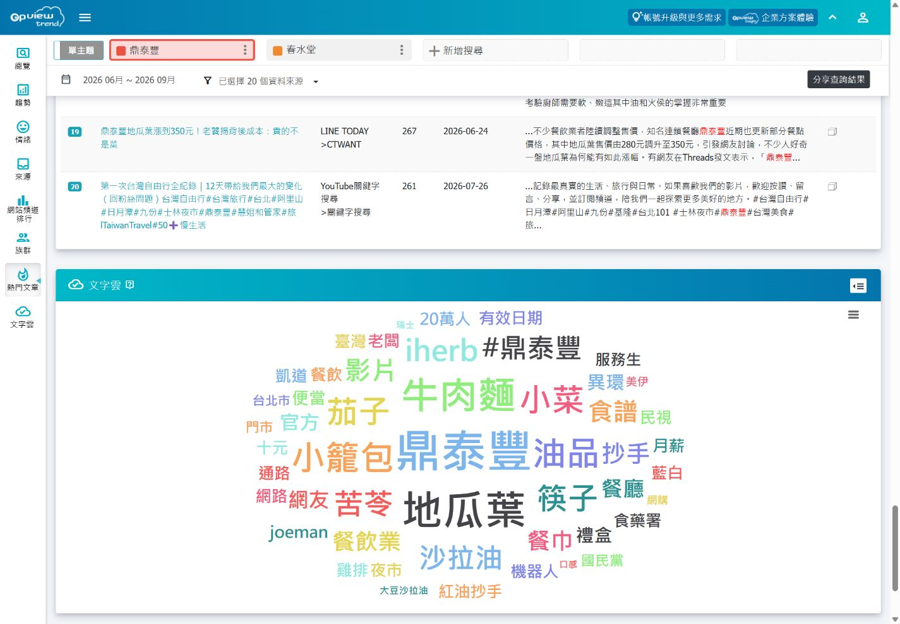

- 時間：2026-09-07 11:16:37（台北）。
- 網址：[操作頁](https://trend.opview.com.tw/trend/Result?page=2#section-cloud)。
- 條件：鼎泰豐；2026-06-01～2026-09-06（介面顯示2026-06～2026-09）；20項來源。
- 操作／可見狀態：全部20來源，2026-06至2026-09；選詞頻模式並等待重繪。
- 證據類型：完成畫面／可見入口；原尺寸 1425×990。
- 設計觀察：本系統用篩選後全部文字快照的tf／df，公開斷詞與停用詞版本；排行與雲共用資料，點詞以相同token回查。

### 10-cloud-help

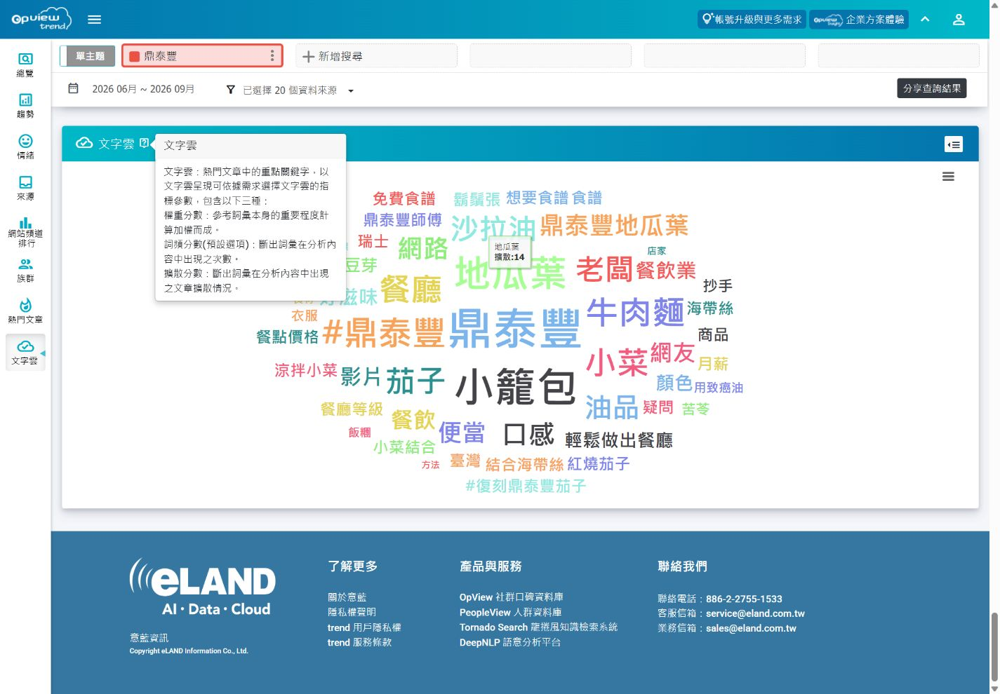

- 時間：2026-09-07 11:01:43（台北）。
- 網址：[操作頁](https://trend.opview.com.tw/trend/Result#section-cloud)。
- 條件：鼎泰豐；2026-06-01～2026-09-06（介面顯示2026-06～2026-09）；20項來源。
- 操作／可見狀態：文字雲方法說明。
- 證據類型：完成畫面／可見入口；原尺寸 1425×990。
- 設計觀察：本系統用篩選後全部文字快照的tf／df，公開斷詞與停用詞版本；排行與雲共用資料，點詞以相同token回查。

### 10-cloud-menu

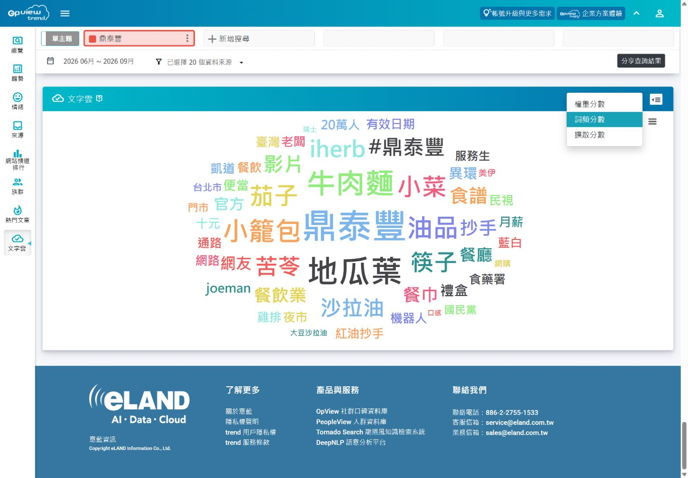

- 時間：2026-09-07 11:00:47（台北）。
- 網址：[操作頁](https://trend.opview.com.tw/trend/Result#section-cloud)。
- 條件：鼎泰豐；2026-06-01～2026-09-06（介面顯示2026-06～2026-09）；20項來源。
- 操作／可見狀態：文字雲計分切換選單。
- 證據類型：完成畫面／可見入口；原尺寸 1425×990。
- 設計觀察：本系統用篩選後全部文字快照的tf／df，公開斷詞與停用詞版本；排行與雲共用資料，點詞以相同token回查。

### 10-cloud-spread

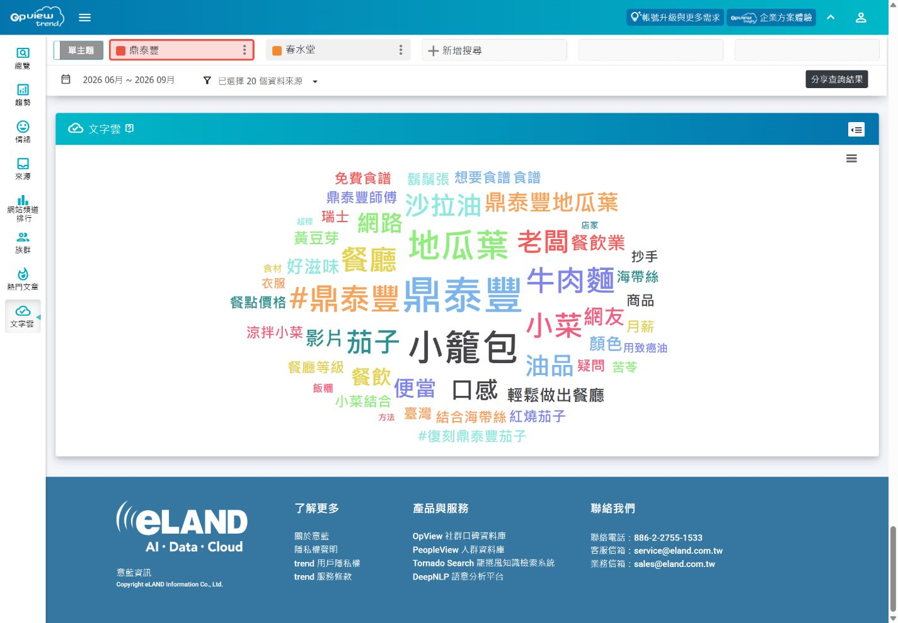

- 時間：2026-09-07 11:13:28（台北）。
- 網址：[操作頁](https://trend.opview.com.tw/trend/Result?page=2#section-cloud)。
- 條件：鼎泰豐；2026-06-01～2026-09-06（介面顯示2026-06～2026-09）；20項來源。
- 操作／可見狀態：全部20來源、2026-06至2026-09，選擴散分數並確認重繪。
- 證據類型：完成畫面／可見入口；原尺寸 1425×990。
- 設計觀察：本系統用篩選後全部文字快照的tf／df，公開斷詞與停用詞版本；排行與雲共用資料，點詞以相同token回查。

### 10-cloud-weight

- 時間：2026-09-07 11:12:56（台北）。
- 網址：[操作頁](https://trend.opview.com.tw/trend/Result?page=2#section-cloud)。
- 條件：鼎泰豐；2026-06-01～2026-09-06（介面顯示2026-06～2026-09）；20項來源。
- 操作／可見狀態：全部20來源、2026-06至2026-09，明確選擇權重分數，已確認完成重繪。
- 證據類型：完成畫面／可見入口；原尺寸 1425×990。
- 設計觀察：本系統用篩選後全部文字快照的tf／df，公開斷詞與停用詞版本；排行與雲共用資料，點詞以相同token回查。

### 10-cloud-word-click

- 時間：2026-09-07 11:01:33（台北）。
- 網址：[操作頁](https://trend.opview.com.tw/trend/Result#section-cloud)。
- 條件：鼎泰豐；2026-06-01～2026-09-06（介面顯示2026-06～2026-09）；20項來源。
- 操作／可見狀態：點地瓜葉，擴散模式下詞語互動。
- 證據類型：完成畫面／可見入口；原尺寸 1425×990。
- 設計觀察：本系統用篩選後全部文字快照的tf／df，公開斷詞與停用詞版本；排行與雲共用資料，點詞以相同token回查。

## 11 下載與分享

**實際觀察與流程：** 圖表選單提供PNG／JPEG。數據下載觸發瀏覽器blob下載，DOM檔名為單主題_趨勢_20260601_20260906.xlsx；未讀取工作簿。頁首分享入口可見；既有米其林分享頁日期停用。

**本系統建議：** 首版沿用CSV／JSON，新增趨勢CSV及可列印頁；不新增公開分享。來源、期間及篩選是否逐欄反映在OpView下載檔仍未驗證。 API、型別、相容策略與驗收案例見[詳細規格](opview-implementation-spec.md)。

### 11-chart-export-menu

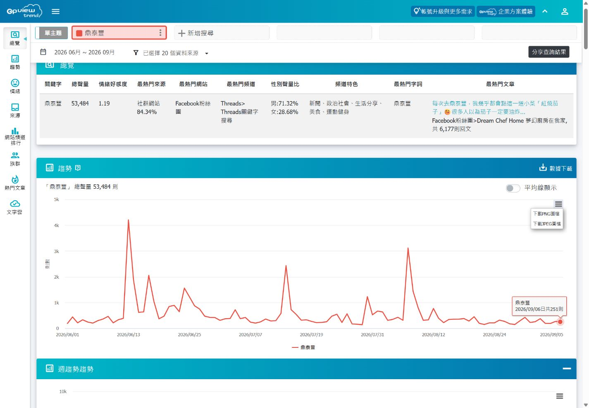

- 時間：2026-09-07 11:02:51（台北）。
- 網址：[操作頁](https://trend.opview.com.tw/trend/Result#section-trend)。
- 條件：鼎泰豐；2026-06-01～2026-09-06（介面顯示2026-06～2026-09）；20項來源。
- 操作／可見狀態：日聲量圖選單：已開啟，見實際可用格式。
- 證據類型：完成畫面／可見入口；原尺寸 1425×990。
- 設計觀察：首版沿用CSV／JSON，新增趨勢CSV及可列印頁；不新增公開分享。來源、期間及篩選是否逐欄反映在OpView下載檔仍未驗證。

### 11-data-download

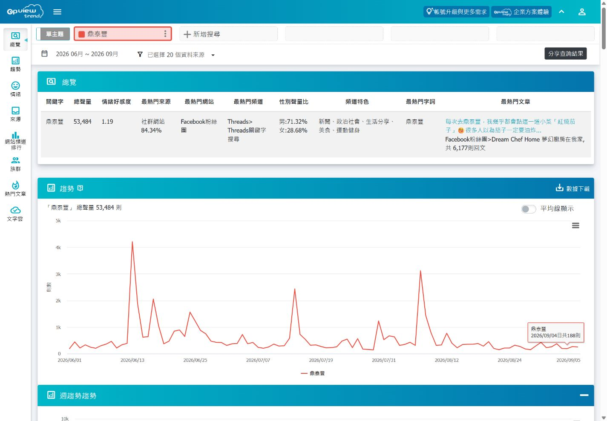

- 時間：2026-09-07 11:02:19（台北）。
- 網址：[操作頁](https://trend.opview.com.tw/trend/Result#section-trend)。
- 條件：鼎泰豐；2026-06-01～2026-09-06（介面顯示2026-06～2026-09）；20項來源。
- 操作／可見狀態：點趨勢數據下載，保存選項或限制。
- 證據類型：完成畫面／可見入口；原尺寸 1425×990。
- 設計觀察：首版沿用CSV／JSON，新增趨勢CSV及可列印頁；不新增公開分享。來源、期間及篩選是否逐欄反映在OpView下載檔仍未驗證。

### 11-shared-report

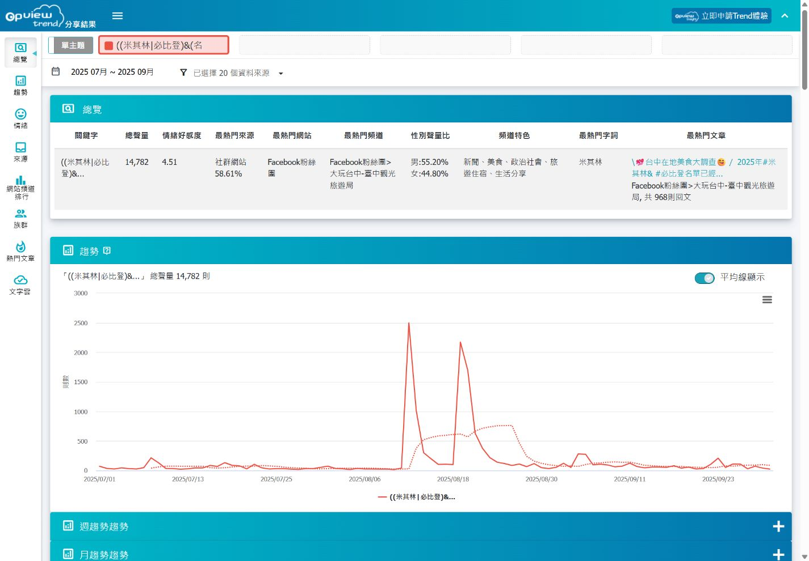

- 時間：2026-09-07 11:10:58（台北）。
- 網址：[操作頁](https://trend.opview.com.tw/trend/s/zgwj0t)。
- 條件：米其林與必比登組合查詢；2025-07～2025-09；20項來源。
- 操作／可見狀態：米其林與必比登；2025-07至2025-09、20來源；提示已關閉且內容完成，日期停用。
- 證據類型：完成畫面／可見入口；原尺寸 1425×990。
- 設計觀察：首版沿用CSV／JSON，新增趨勢CSV及可列印頁；不新增公開分享。來源、期間及篩選是否逐欄反映在OpView下載檔仍未驗證。

## 12 等待與限制

**實際觀察與流程：** 查詢中切多主題顯示請稍後；少於兩個選中主題會提示。首次Facebook討論串等待後仍在載入，不算錯誤或成功；後續PTT討論串已成功。

**本系統建議：** 建立loading／ready／empty／partial／error明確狀態，保留已完成區段；重試需保持scope，不以零值掩蓋失敗。 API、型別、相容策略與驗收案例見[詳細規格](opview-implementation-spec.md)。

### 12-busy-guard

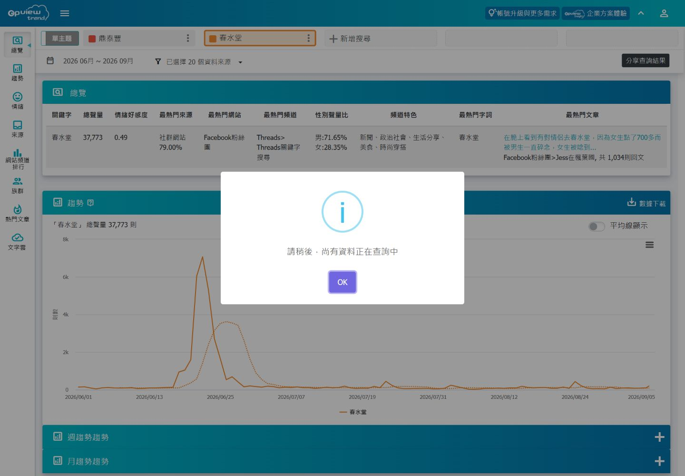

- 時間：2026-09-07 11:03:37（台北）。
- 網址：[操作頁](https://trend.opview.com.tw/trend/Result#section-overview)。
- 條件：鼎泰豐；2026-06-01～2026-09-06（介面顯示2026-06～2026-09）；20項來源。
- 操作／可見狀態：查詢未完成時切換多主題，系統顯示請稍後。
- 證據類型：等待／限制狀態；原尺寸 1440×1000。
- 設計觀察：建立loading／ready／empty／partial／error明確狀態，保留已完成區段；重試需保持scope，不以零值掩蓋失敗。

### 12-compare-validation

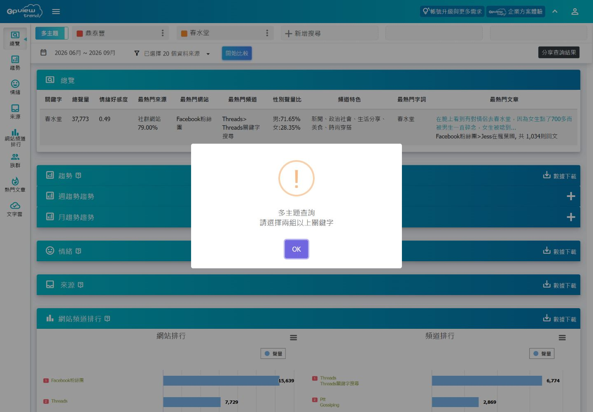

- 時間：2026-09-07 11:04:05（台北）。
- 網址：[操作頁](https://trend.opview.com.tw/trend/Result#section-overview)。
- 條件：鼎泰豐＋春水堂；2026-06～2026-09；20項來源；是否完成以圖說為準。
- 操作／可見狀態：多主題需選兩組以上關鍵字；只有加入不足以比較。
- 證據類型：等待／限制狀態；原尺寸 1440×1000。
- 設計觀察：建立loading／ready／empty／partial／error明確狀態，保留已完成區段；重試需保持scope，不以零值掩蓋失敗。

### 12-thread-loading

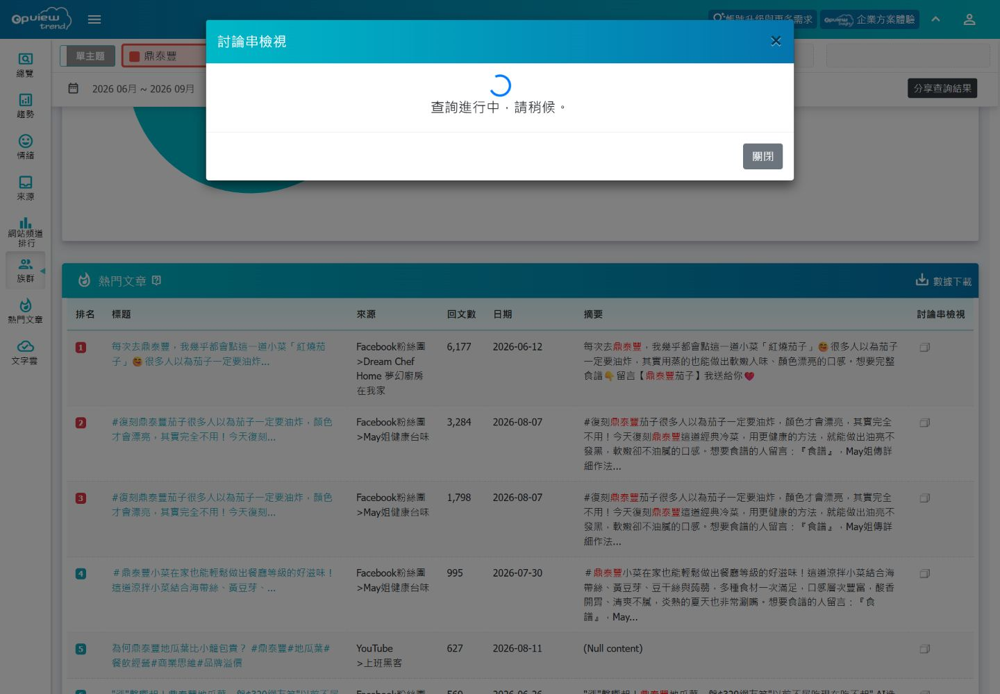

- 時間：2026-09-07 11:00:32（台北）。
- 網址：[操作頁](https://trend.opview.com.tw/trend/Result#FOLURM)。
- 條件：鼎泰豐；2026-06-01～2026-09-06（介面顯示2026-06～2026-09）；20項來源。
- 操作／可見狀態：討論串檢視；等待後狀態見畫面，未將載入視為完成。
- 證據類型：等待／限制狀態；原尺寸 1440×1000。
- 設計觀察：建立loading／ready／empty／partial／error明確狀態，保留已完成區段；重試需保持scope，不以零值掩蓋失敗。

## 13 社群競爭力矩陣

**實際觀察與流程：** 多主題模式新增矩陣；說明X為相對數位市占率、Y為平均聲量成長率。完整計分公式與氣泡尺寸意義未驗證。多主題導覽未顯示文字雲。

**本系統建議：** 比較重用現有趨勢與共同面向；矩陣另案，不能將本機樣本占比標示為市場占有率。 API、型別、相容策略與驗收案例見[詳細規格](opview-implementation-spec.md)。

### 13-competition-help

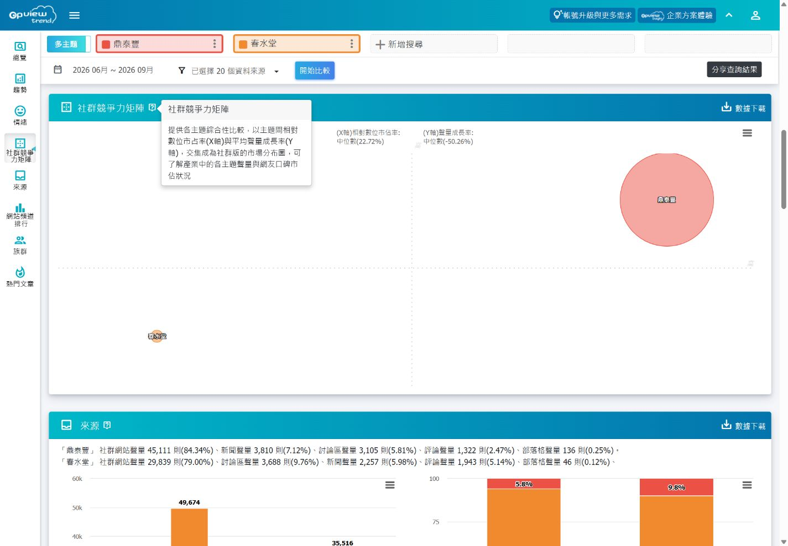

- 時間：2026-09-07 11:05:16（台北）。
- 網址：[操作頁](https://trend.opview.com.tw/trend/Result#section-bcg-matrix)。
- 條件：鼎泰豐＋春水堂；2026-06～2026-09；20項來源；是否完成以圖說為準。
- 操作／可見狀態：社群競爭力矩陣說明。
- 證據類型：完成畫面／可見入口；原尺寸 1425×990。
- 設計觀察：比較重用現有趨勢與共同面向；矩陣另案，不能將本機樣本占比標示為市場占有率。

### 13-competition-matrix

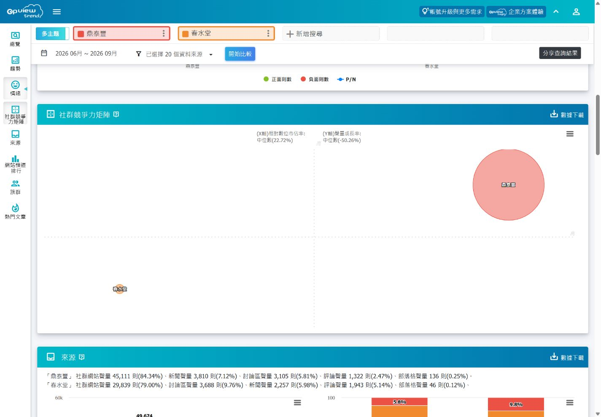

- 時間：2026-09-07 11:05:04（台北）。
- 網址：[操作頁](https://trend.opview.com.tw/trend/Result#section-bcg-matrix)。
- 條件：鼎泰豐＋春水堂；2026-06～2026-09；20項來源；是否完成以圖說為準。
- 操作／可見狀態：多主題新增社群競爭力矩陣。
- 證據類型：完成畫面／可見入口；原尺寸 1425×990。
- 設計觀察：比較重用現有趨勢與共同面向；矩陣另案，不能將本機樣本占比標示為市場占有率。

## 01 首頁與導覽

**實際觀察與流程：** 使用者從首頁輸入關鍵字，或由餐飲案例進入既有報告；下方提供教學與研究入口。結果頁左側導覽可收合。應用案例已用公開分享補充，影片播放與研究PDF內容未測。

**本系統建議：** 沿用任務建立與報告頁，增加區段導覽；不新增全網搜尋承諾。 API、型別、相容策略與驗收案例見[詳細規格](opview-implementation-spec.md)。

### 01-home-research

- 時間：2026-09-07 10:57:09（台北）。
- 網址：[操作頁](https://trend.opview.com.tw/trend/Explore)。
- 條件：首頁，未套用分析條件。
- 操作／可見狀態：首頁向下捲動一頁：教學、研究入口。
- 證據類型：完成畫面／可見入口；原尺寸 1425×990。
- 設計觀察：沿用任務建立與報告頁，增加區段導覽；不新增全網搜尋承諾。

### 01-home-search

- 時間：2026-09-07 10:57:03（台北）。
- 網址：[操作頁](https://trend.opview.com.tw/trend/Explore)。
- 條件：首頁，未套用分析條件。
- 操作／可見狀態：首頁搜尋、案例與教學入口。
- 證據類型：完成畫面／可見入口；原尺寸 1425×990。
- 設計觀察：沿用任務建立與報告頁，增加區段導覽；不新增全網搜尋承諾。

### 01-sidebar-collapsed

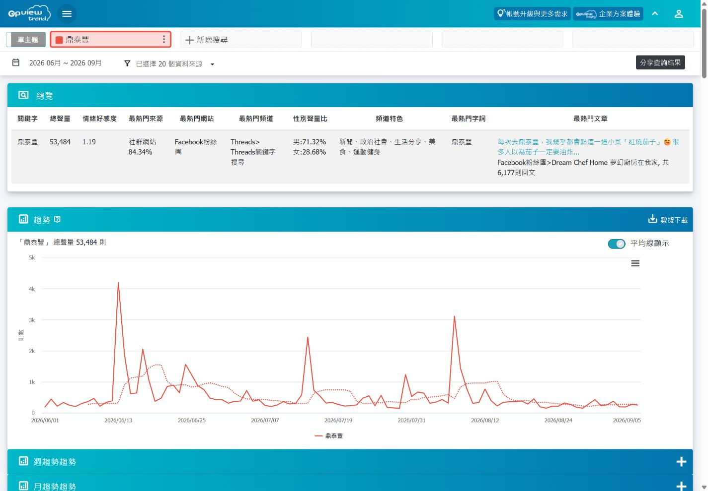

- 時間：2026-09-07 10:58:10（台北）。
- 網址：[操作頁](https://trend.opview.com.tw/trend/Result#section-overview)。
- 條件：鼎泰豐；2026-06-01～2026-09-06（介面顯示2026-06～2026-09）；20項來源。
- 操作／可見狀態：點左上選單收合導覽。
- 證據類型：完成畫面／可見入口；原尺寸 1425×990。
- 設計觀察：沿用任務建立與報告頁，增加區段導覽；不新增全網搜尋承諾。

## 02 查詢管理與總覽

**實際觀察與流程：** 新增春水堂後離開輸入欄，完成第二主題查詢；切多主題、點選兩個主題卡、按開始比較。完成總覽分別呈現鼎泰豐53,484與春水堂37,773。更多選單含編輯／移除，但編輯未成功驗證。

**本系統建議：** 重用品牌比較API與報告選擇器；區分已加入、已選取、已完成三種狀態。摘要需要統一快照與共用篩選。 API、型別、相容策略與驗收案例見[詳細規格](opview-implementation-spec.md)。

### 02-compare-pending

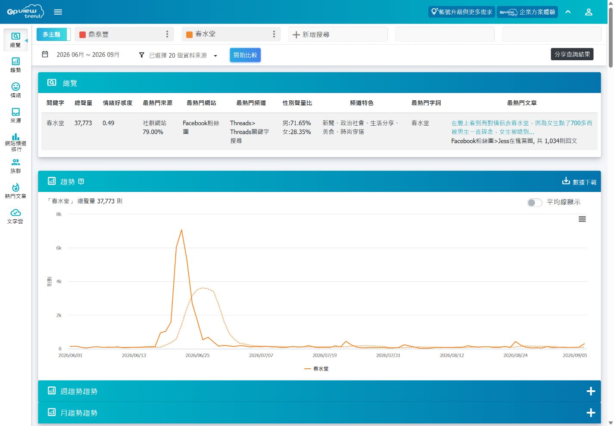

- 時間：2026-09-07 11:03:55（台北）。
- 網址：[操作頁](https://trend.opview.com.tw/trend/Result#section-overview)。
- 條件：鼎泰豐＋春水堂；2026-06～2026-09；20項來源；是否完成以圖說為準。
- 操作／可見狀態：雙主題已加入，切多主題後需按開始比較。
- 證據類型：草稿／過渡狀態；原尺寸 1425×990。
- 設計觀察：重用品牌比較API與報告選擇器；區分已加入、已選取、已完成三種狀態。摘要需要統一快照與共用篩選。

### 02-compare-selected

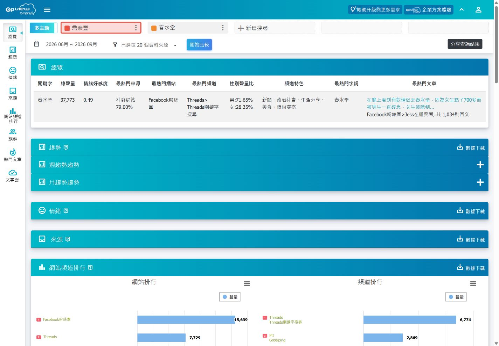

- 時間：2026-09-07 11:04:26（台北）。
- 網址：[操作頁](https://trend.opview.com.tw/trend/Result#section-overview)。
- 條件：鼎泰豐＋春水堂；2026-06～2026-09；20項來源；是否完成以圖說為準。
- 操作／可見狀態：多主題下點選鼎泰豐與春水堂兩個主題卡。
- 證據類型：草稿／過渡狀態；原尺寸 1425×990。
- 設計觀察：重用品牌比較API與報告選擇器；區分已加入、已選取、已完成三種狀態。摘要需要統一快照與共用篩選。

### 02-overview-multi

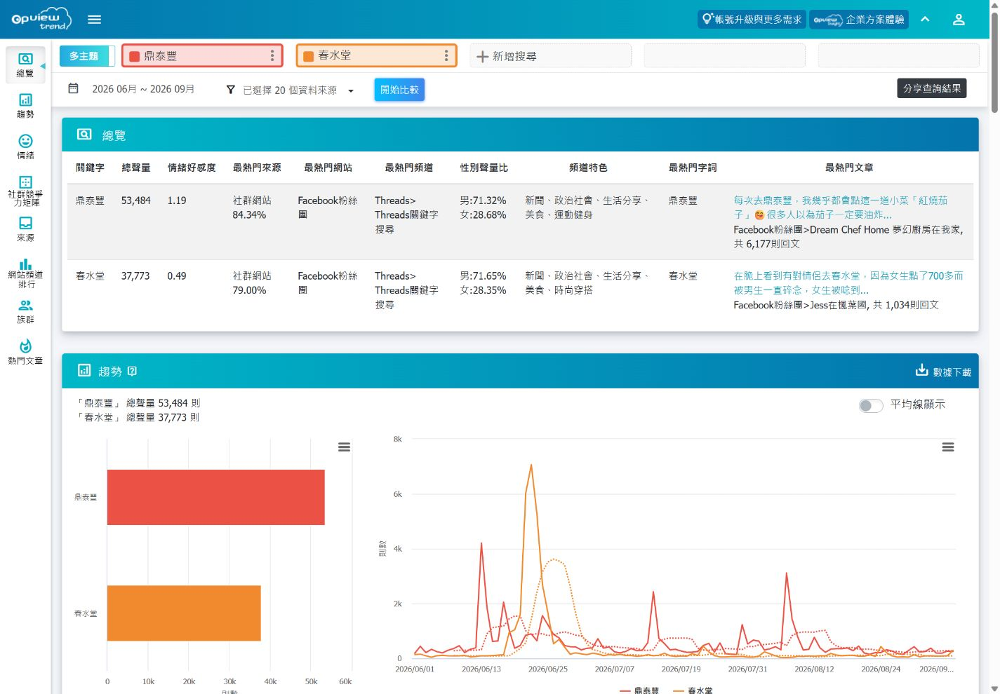

- 時間：2026-09-07 11:05:01（台北）。
- 網址：[操作頁](https://trend.opview.com.tw/trend/Result#section-overview)。
- 條件：鼎泰豐＋春水堂；2026-06～2026-09；20項來源；是否完成以圖說為準。
- 操作／可見狀態：鼎泰豐與春水堂比較完成，2026-06至2026-09、20來源。
- 證據類型：完成畫面／可見入口；原尺寸 1425×990。
- 設計觀察：重用品牌比較API與報告選擇器；區分已加入、已選取、已完成三種狀態。摘要需要統一快照與共用篩選。

### 02-overview-single

- 時間：2026-09-07 10:58:08（台北）。
- 網址：[操作頁](https://trend.opview.com.tw/trend/Result#section-overview)。
- 條件：鼎泰豐；2026-06-01～2026-09-06（介面顯示2026-06～2026-09）；20項來源。
- 操作／可見狀態：鼎泰豐，2026-06至2026-09，20來源，總聲量53484。
- 證據類型：完成畫面／可見入口；原尺寸 1425×990。
- 設計觀察：重用品牌比較API與報告選擇器；區分已加入、已選取、已完成三種狀態。摘要需要統一快照與共用篩選。

### 02-query-add-transition

- 時間：2026-09-07 11:03:21（台北）。
- 網址：[操作頁](https://trend.opview.com.tw/trend/Result#section-overview)。
- 條件：鼎泰豐；2026-06-01～2026-09-06（介面顯示2026-06～2026-09）；20項來源。
- 操作／可見狀態：新增主題操作前後的過渡畫面；此圖尚未呈現春水堂完成結果，成功證據見雙主題總覽。
- 證據類型：草稿／過渡狀態；原尺寸 1425×990。
- 設計觀察：重用品牌比較API與報告選擇器；區分已加入、已選取、已完成三種狀態。摘要需要統一快照與共用篩選。

### 02-query-edit-unverified

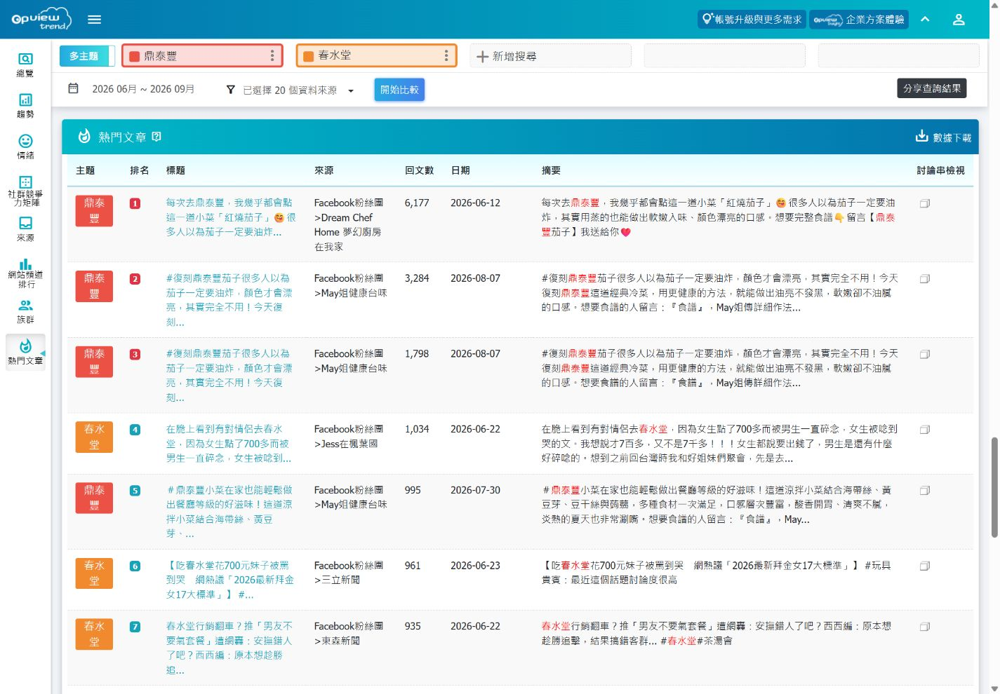

- 時間：2026-09-07 11:05:44（台北）。
- 網址：[操作頁](https://trend.opview.com.tw/trend/Result#section-articles)。
- 條件：鼎泰豐；2026-06-01～2026-09-06（介面顯示2026-06～2026-09）；20項來源。
- 操作／可見狀態：點主題選單「編輯」後未確認可編輯欄位；此圖不能作為編輯成功證據。
- 證據類型：操作結果未驗證；原尺寸 1425×990。
- 設計觀察：重用品牌比較API與報告選擇器；區分已加入、已選取、已完成三種狀態。摘要需要統一快照與共用篩選。

### 02-query-menu

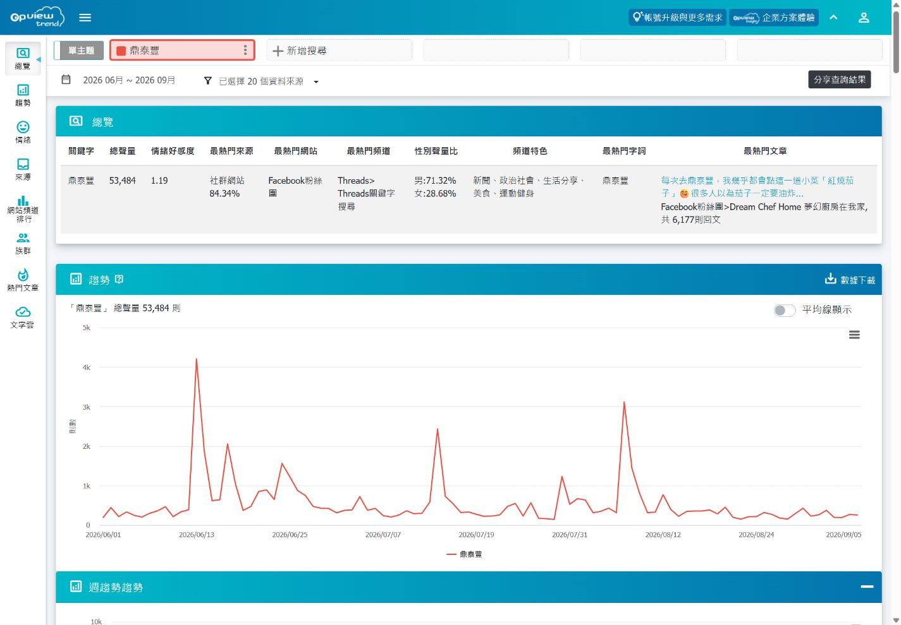

- 時間：2026-09-07 11:03:05（台北）。
- 網址：[操作頁](https://trend.opview.com.tw/trend/Result#section-overview)。
- 條件：鼎泰豐；2026-06-01～2026-09-06（介面顯示2026-06～2026-09）；20項來源。
- 操作／可見狀態：主題更多選單。
- 證據類型：完成畫面／可見入口；原尺寸 1425×990。
- 設計觀察：重用品牌比較API與報告選擇器；區分已加入、已選取、已完成三種狀態。摘要需要統一快照與共用篩選。

## 03 日期與資料來源

**實際觀察與流程：** 日期選擇器以年月及過去3／6／12個月捷徑呈現。改條件後需重新查詢。來源清單20項；只選PTT主文／回文再套用，鼎泰豐聲量變2,803、P/N為0.47。

**本系統建議：** 草稿與已套用條件分離；顯示來源失敗及日期精度。未套用時禁止以新條件描述舊圖，匯出沿用已套用scope。 API、型別、相容策略與驗收案例見[詳細規格](opview-implementation-spec.md)。

### 03-date-pending

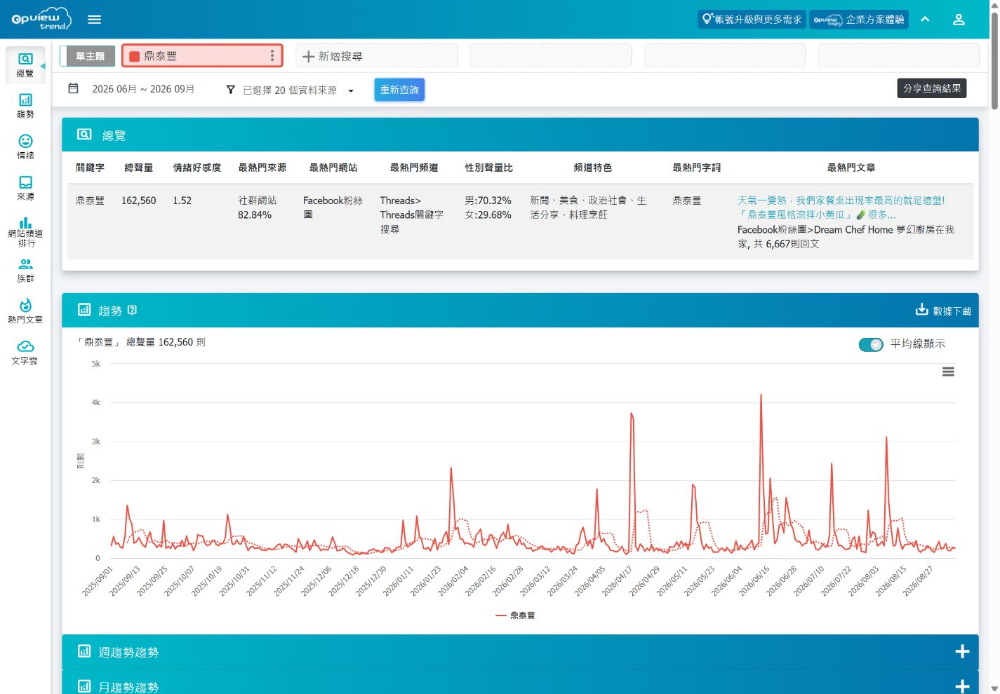

- 時間：2026-09-07 10:57:32（台北）。
- 網址：[操作頁](https://trend.opview.com.tw/trend/Result)。
- 條件：草稿2026-06～2026-09；圖表仍為原期間，尚未重新查詢。
- 操作／可見狀態：過去3個月：2026-06至2026-09，出現重新查詢，圖表尚未更新。
- 證據類型：草稿／過渡狀態；原尺寸 1425×990。
- 設計觀察：草稿與已套用條件分離；顯示來源失敗及日期精度。未套用時禁止以新條件描述舊圖，匯出沿用已套用scope。

### 03-date-picker

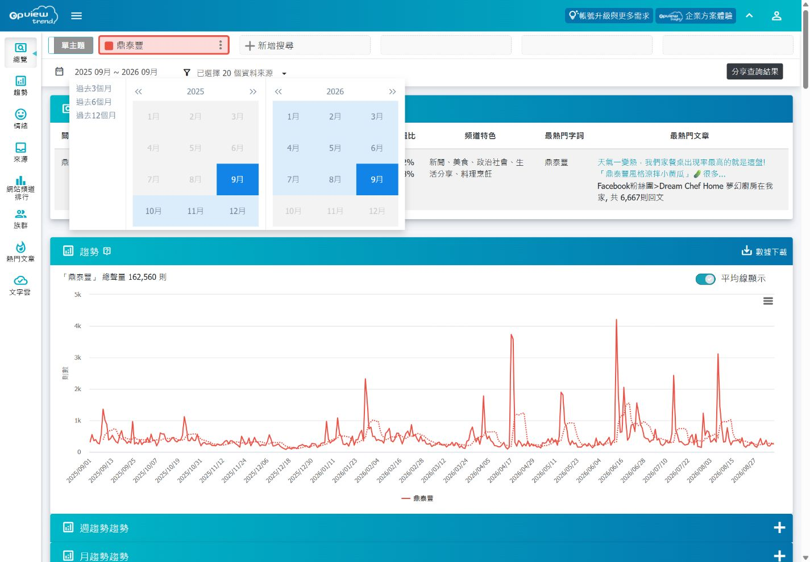

- 時間：2026-09-07 10:57:18（台北）。
- 網址：[操作頁](https://trend.opview.com.tw/trend/Result)。
- 條件：鼎泰豐；原期間2025-09～2026-09；20項來源。
- 操作／可見狀態：點日期欄，觀察可選期間。
- 證據類型：完成畫面／可見入口；原尺寸 1425×990。
- 設計觀察：草稿與已套用條件分離；顯示來源失敗及日期精度。未套用時禁止以新條件描述舊圖，匯出沿用已套用scope。

### 03-source-options

- 時間：2026-09-07 10:57:48（台北）。
- 網址：[操作頁](https://trend.opview.com.tw/trend/Result)。
- 條件：鼎泰豐；2026-06-01～2026-09-06（介面顯示2026-06～2026-09）；20項來源。
- 操作／可見狀態：鼎泰豐、2026-06至2026-09，展開來源篩選。
- 證據類型：完成畫面／可見入口；原尺寸 1425×990。
- 設計觀察：草稿與已套用條件分離；顯示來源失敗及日期精度。未套用時禁止以新條件描述舊圖，匯出沿用已套用scope。

### 03-source-options-lower

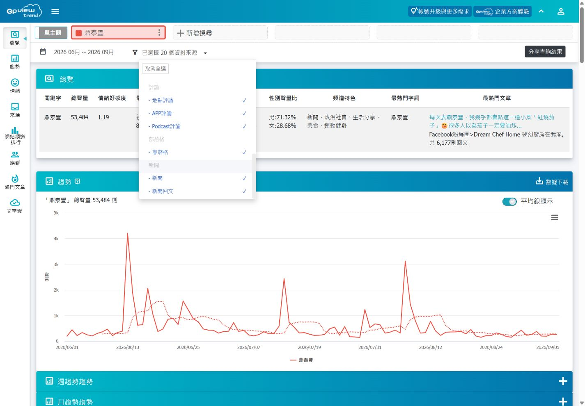

- 時間：2026-09-07 10:58:07（台北）。
- 網址：[操作頁](https://trend.opview.com.tw/trend/Result)。
- 條件：鼎泰豐；2026-06-01～2026-09-06（介面顯示2026-06～2026-09）；20項來源。
- 操作／可見狀態：來源下拉清單內向下捲動，查看其他來源。
- 證據類型：完成畫面／可見入口；原尺寸 1425×990。
- 設計觀察：草稿與已套用條件分離；顯示來源失敗及日期精度。未套用時禁止以新條件描述舊圖，匯出沿用已套用scope。

### 03-source-ptt-pending

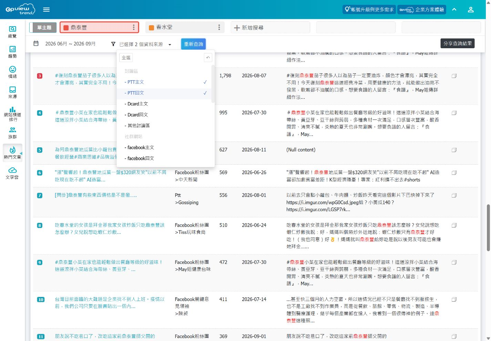

- 時間：2026-09-07 11:06:41（台北）。
- 網址：[操作頁](https://trend.opview.com.tw/trend/Result#section-articles)。
- 條件：鼎泰豐；2026-06～2026-09；僅PTT主文／回文。
- 操作／可見狀態：只選PTT主文與回文，尚待重新查詢。
- 證據類型：草稿／過渡狀態；原尺寸 1425×990。
- 設計觀察：草稿與已套用條件分離；顯示來源失敗及日期精度。未套用時禁止以新條件描述舊圖，匯出沿用已套用scope。

### 03-source-ptt-result

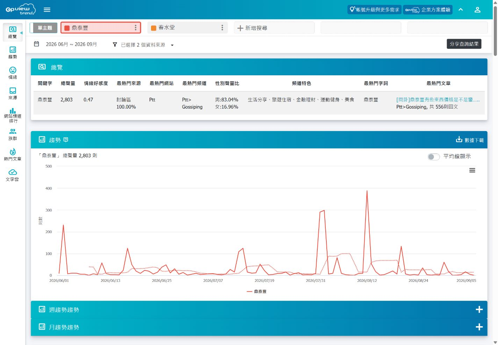

- 時間：2026-09-07 11:10:23（台北）。
- 網址：[操作頁](https://trend.opview.com.tw/trend/Result?page=2#section-overview)。
- 條件：鼎泰豐；2026-06～2026-09；僅PTT主文／回文。
- 操作／可見狀態：鼎泰豐、2026-06至2026-09、PTT主文與回文，總聲量2803，回頁首確認完成。
- 證據類型：完成畫面／可見入口；原尺寸 1425×990。
- 設計觀察：草稿與已套用條件分離；顯示來源失敗及日期精度。未套用時禁止以新條件描述舊圖，匯出沿用已套用scope。

## 04 聲量趨勢

**實際觀察與流程：** 日折線、週月柱圖；平均線可關閉。點2026-06-13峰值顯示4,205，並在圖下展開當日文章。多主題疊圖並附總量比較。

**本系統建議：** 日／週／月同區切換，點桶開證據抽屜。共用interval精度策略；統計與文章頁不得分別讀歷史快照與目前資料。 API、型別、相容策略與驗收案例見[詳細規格](opview-implementation-spec.md)。

### 04-trend-day-average

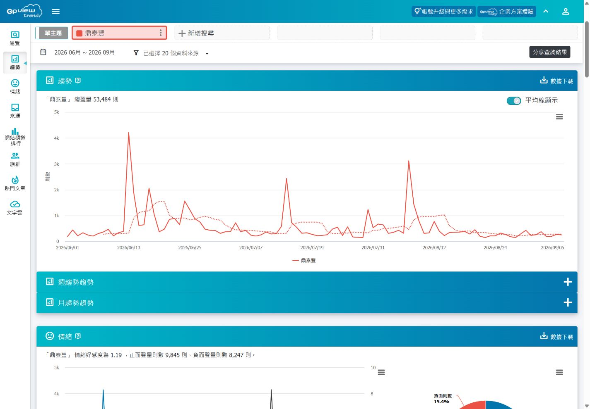

- 時間：2026-09-07 10:58:40（台北）。
- 網址：[操作頁](https://trend.opview.com.tw/trend/Result#section-trend)。
- 條件：鼎泰豐；2026-06-01～2026-09-06（介面顯示2026-06～2026-09）；20項來源。
- 操作／可見狀態：2026-06至2026-09，日趨勢與平均線。
- 證據類型：完成畫面／可見入口；原尺寸 1425×990。
- 設計觀察：日／週／月同區切換，點桶開證據抽屜。共用interval精度策略；統計與文章頁不得分別讀歷史快照與目前資料。

### 04-trend-day-no-average

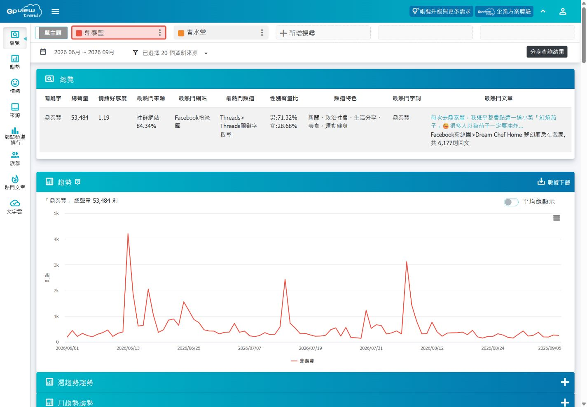

- 時間：2026-09-07 11:17:13（台北）。
- 網址：[操作頁](https://trend.opview.com.tw/trend/Result?page=2#section-cloud)。
- 條件：鼎泰豐；2026-06-01～2026-09-06（介面顯示2026-06～2026-09）；20項來源。
- 操作／可見狀態：全部20來源、2026-06至2026-09，平均線關閉且虛線已消失。
- 證據類型：完成畫面／可見入口；原尺寸 1425×990。
- 設計觀察：日／週／月同區切換，點桶開證據抽屜。共用interval精度策略；統計與文章頁不得分別讀歷史快照與目前資料。

### 04-trend-drilldown

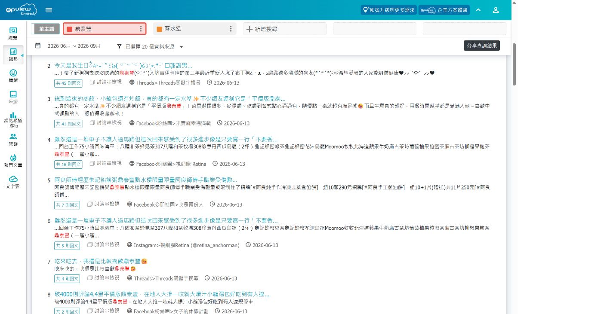

- 時間：2026-09-07 11:22:19（台北）。
- 網址：[操作頁](https://trend.opview.com.tw/trend/Result?page=2#section-cloud)。
- 條件：鼎泰豐；2026-06-01～2026-09-06（介面顯示2026-06～2026-09）；20項來源。
- 操作／可見狀態：點選2026-06-13聲量高峰後向下捲動；圖下展開當日文章、摘要、回文數與討論串入口。
- 證據類型：完成畫面／可見入口；原尺寸 1425×731。
- 設計觀察：日／週／月同區切換，點桶開證據抽屜。共用interval精度策略；統計與文章頁不得分別讀歷史快照與目前資料。

### 04-trend-help

- 時間：2026-09-07 11:01:47（台北）。
- 網址：[操作頁](https://trend.opview.com.tw/trend/Result#section-trend)。
- 條件：鼎泰豐；2026-06-01～2026-09-06（介面顯示2026-06～2026-09）；20項來源。
- 操作／可見狀態：趨勢說明入口可見；此張沒有展開說明，不能作為提示內容證據。
- 證據類型：完成畫面／可見入口；原尺寸 1425×990。
- 設計觀察：日／週／月同區切換，點桶開證據抽屜。共用interval精度策略；統計與文章頁不得分別讀歷史快照與目前資料。

### 04-trend-month

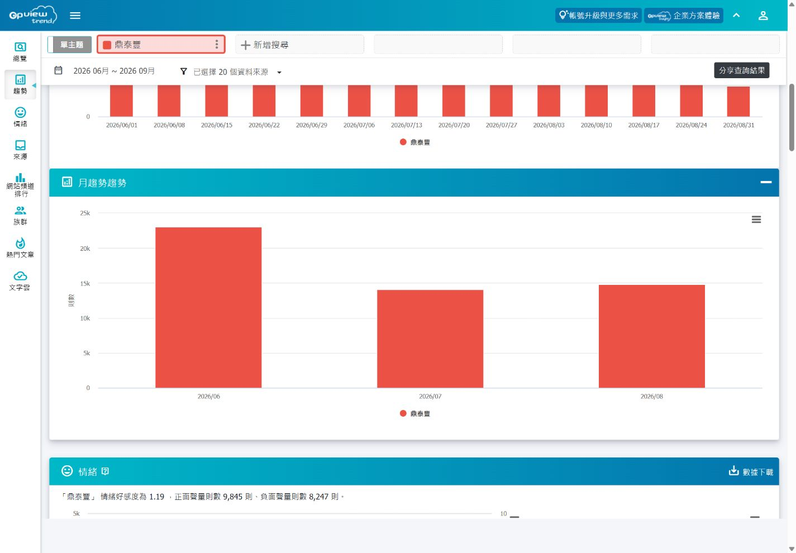

- 時間：2026-09-07 10:59:05（台北）。
- 網址：[操作頁](https://trend.opview.com.tw/trend/Result#section-trend)。
- 條件：鼎泰豐；2026-06-01～2026-09-06（介面顯示2026-06～2026-09）；20項來源。
- 操作／可見狀態：展開月聲量柱圖。
- 證據類型：完成畫面／可見入口；原尺寸 1425×990。
- 設計觀察：日／週／月同區切換，點桶開證據抽屜。共用interval精度策略；統計與文章頁不得分別讀歷史快照與目前資料。

### 04-trend-multi

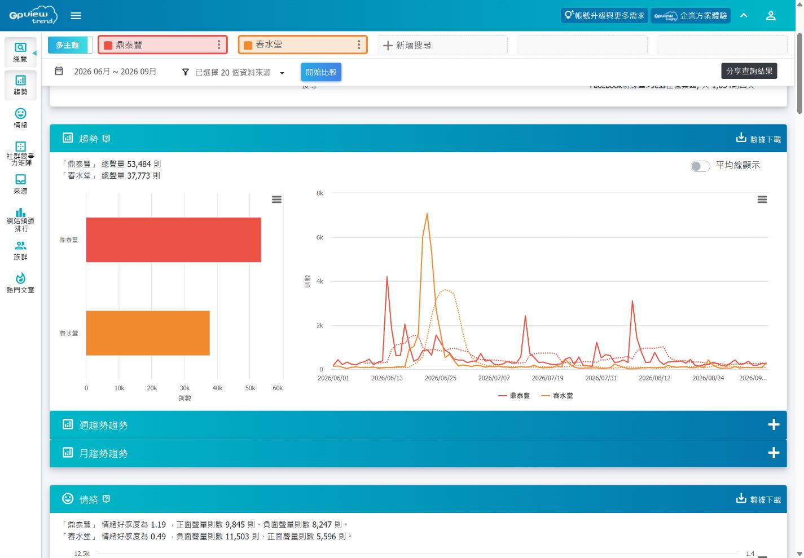

- 時間：2026-09-07 11:05:03（台北）。
- 網址：[操作頁](https://trend.opview.com.tw/trend/Result#section-trend)。
- 條件：鼎泰豐＋春水堂；2026-06～2026-09；20項來源；是否完成以圖說為準。
- 操作／可見狀態：雙品牌聲量折線疊圖。
- 證據類型：完成畫面／可見入口；原尺寸 1425×990。
- 設計觀察：日／週／月同區切換，點桶開證據抽屜。共用interval精度策略；統計與文章頁不得分別讀歷史快照與目前資料。

### 04-trend-point

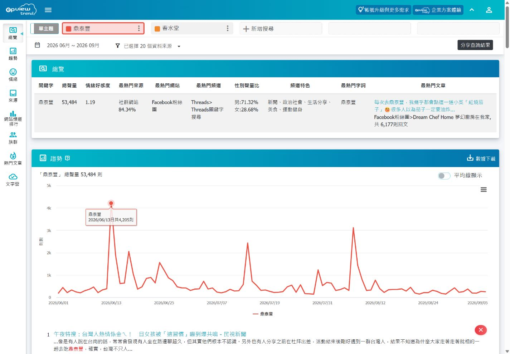

- 時間：2026-09-07 11:18:02（台北）。
- 網址：[操作頁](https://trend.opview.com.tw/trend/Result?page=2#section-cloud)。
- 條件：鼎泰豐；2026-06-01～2026-09-06（介面顯示2026-06～2026-09）；20項來源。
- 操作／可見狀態：點2026-06-13峰值：4205則；觸發額外明細查詢。
- 證據類型：完成畫面／可見入口；原尺寸 1425×990。
- 設計觀察：日／週／月同區切換，點桶開證據抽屜。共用interval精度策略；統計與文章頁不得分別讀歷史快照與目前資料。

### 04-trend-week

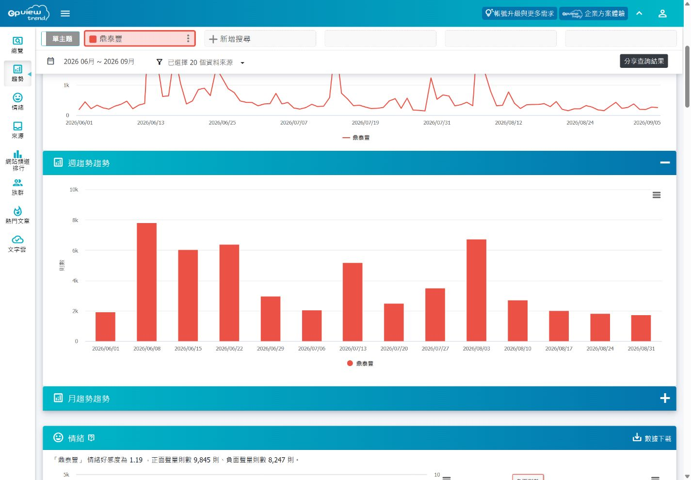

- 時間：2026-09-07 10:59:00（台北）。
- 網址：[操作頁](https://trend.opview.com.tw/trend/Result#section-trend)。
- 條件：鼎泰豐；2026-06-01～2026-09-06（介面顯示2026-06～2026-09）；20項來源。
- 操作／可見狀態：展開週聲量柱圖，含區段標題。
- 證據類型：完成畫面／可見入口；原尺寸 1425×990。
- 設計觀察：日／週／月同區切換，點桶開證據抽屜。共用interval精度策略；統計與文章頁不得分別讀歷史快照與目前資料。

## 05 情緒

**實際觀察與流程：** 日序列搭配分布圓餅，P/N使用另一軸；週／月展開呈現情緒柱圖及比例線，多主題改比較排列。情緒分類準確度與零分母呈現未驗證。

**本系統建議：** 新增正／中／負完整序列；本地P/N明定positive/negative，分母0回null與原因，僅星等不進文字情緒分母。 API、型別、相容策略與驗收案例見[詳細規格](opview-implementation-spec.md)。

### 05-emotion-day

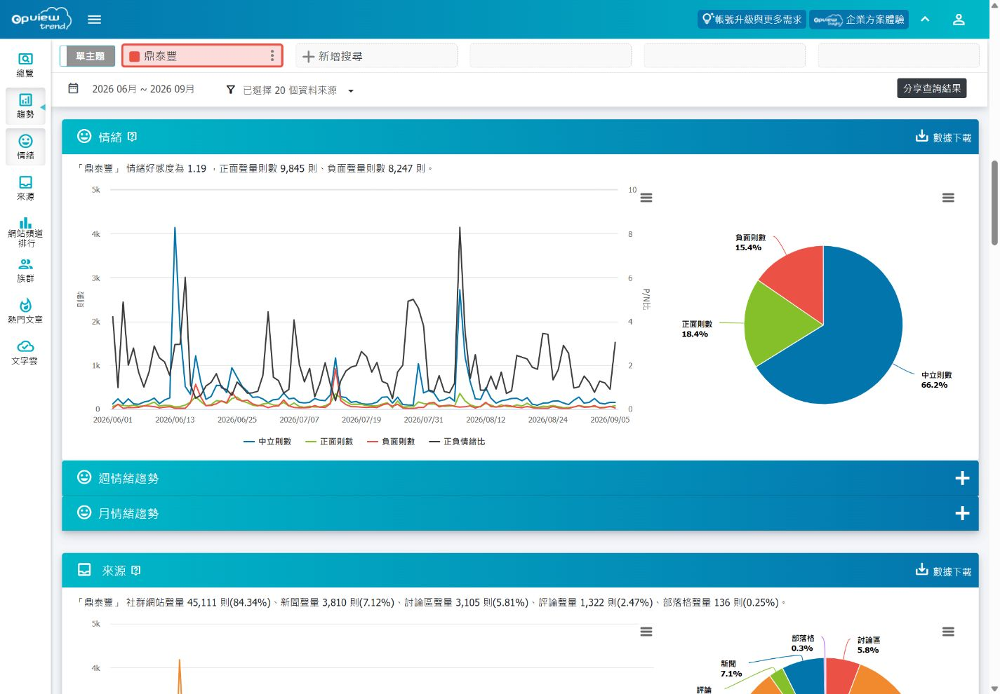

- 時間：2026-09-07 10:59:06（台北）。
- 網址：[操作頁](https://trend.opview.com.tw/trend/Result#section-mood)。
- 條件：鼎泰豐；2026-06-01～2026-09-06（介面顯示2026-06～2026-09）；20項來源。
- 操作／可見狀態：情緒日序列、P/N雙軸與圓餅分布。
- 證據類型：完成畫面／可見入口；原尺寸 1425×990。
- 設計觀察：新增正／中／負完整序列；本地P/N明定positive/negative，分母0回null與原因，僅星等不進文字情緒分母。

### 05-emotion-month

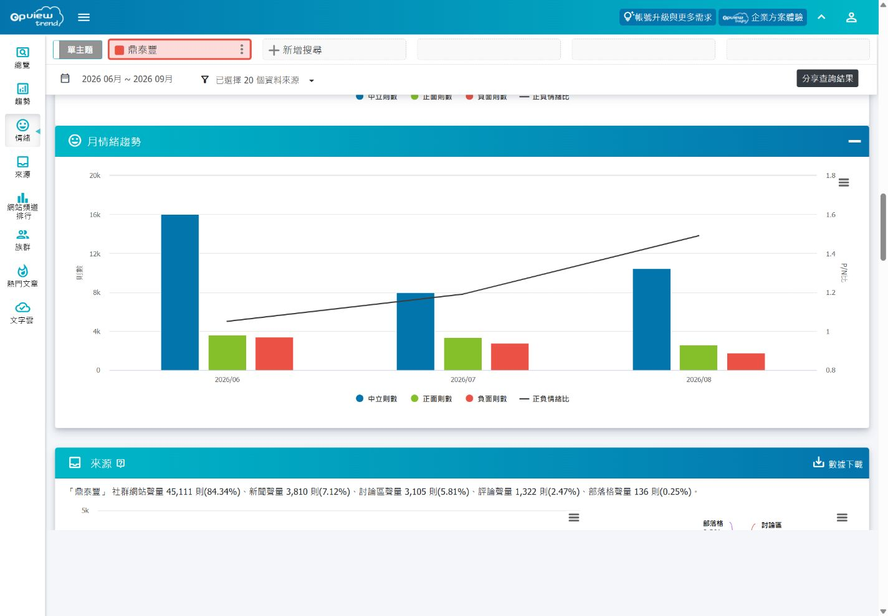

- 時間：2026-09-07 10:59:28（台北）。
- 網址：[操作頁](https://trend.opview.com.tw/trend/Result#section-mood)。
- 條件：鼎泰豐；2026-06-01～2026-09-06（介面顯示2026-06～2026-09）；20項來源。
- 操作／可見狀態：展開月情緒與P/N。
- 證據類型：完成畫面／可見入口；原尺寸 1425×990。
- 設計觀察：新增正／中／負完整序列；本地P/N明定positive/negative，分母0回null與原因，僅星等不進文字情緒分母。

### 05-emotion-multi

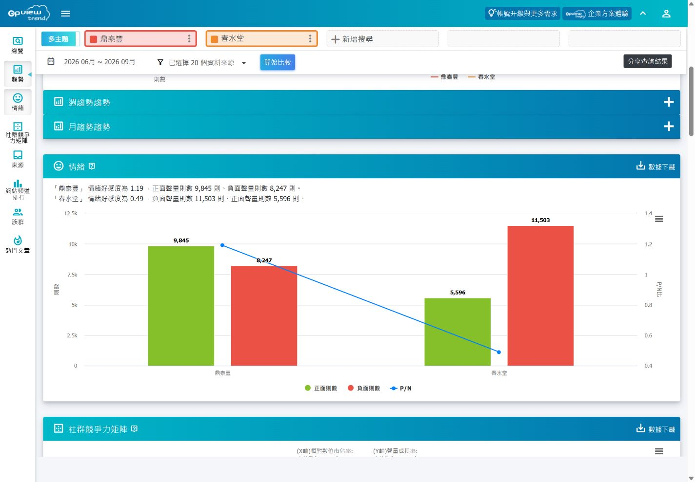

- 時間：2026-09-07 11:05:04（台北）。
- 網址：[操作頁](https://trend.opview.com.tw/trend/Result#section-mood)。
- 條件：鼎泰豐＋春水堂；2026-06～2026-09；20項來源；是否完成以圖說為準。
- 操作／可見狀態：多主題情緒比較。
- 證據類型：完成畫面／可見入口；原尺寸 1425×990。
- 設計觀察：新增正／中／負完整序列；本地P/N明定positive/negative，分母0回null與原因，僅星等不進文字情緒分母。

### 05-emotion-week

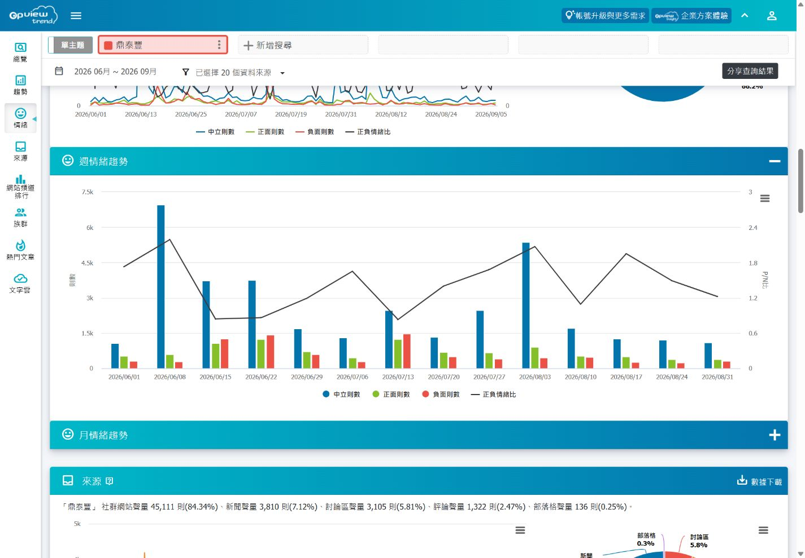

- 時間：2026-09-07 10:59:11（台北）。
- 網址：[操作頁](https://trend.opview.com.tw/trend/Result#section-mood)。
- 條件：鼎泰豐；2026-06-01～2026-09-06（介面顯示2026-06～2026-09）；20項來源。
- 操作／可見狀態：展開週情緒序列。
- 證據類型：完成畫面／可見入口；原尺寸 1425×990。
- 設計觀察：新增正／中／負完整序列；本地P/N明定positive/negative，分母0回null與原因，僅星等不進文字情緒分母。

## 06 來源分析

**實際觀察與流程：** 組成圓餅配日序列，另可展開週／月；多主題提供來源量與比例比較。PTT條件重算已驗證，圖例逐一隱藏與來源圖點擊下鑽未完成驗證。

**本系統建議：** 重用三平台source欄位，新增同scope來源桶；來源缺失單列，不增加本期平台邊界。 API、型別、相容策略與驗收案例見[詳細規格](opview-implementation-spec.md)。

### 06-source-day

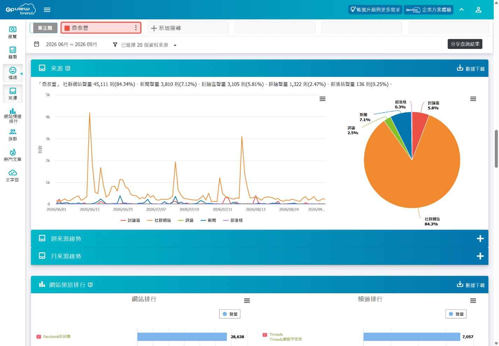

- 時間：2026-09-07 10:59:30（台北）。
- 網址：[操作頁](https://trend.opview.com.tw/trend/Result#section-source)。
- 條件：鼎泰豐；2026-06-01～2026-09-06（介面顯示2026-06～2026-09）；20項來源。
- 操作／可見狀態：來源日序列與組成圓餅。
- 證據類型：完成畫面／可見入口；原尺寸 1425×990。
- 設計觀察：重用三平台source欄位，新增同scope來源桶；來源缺失單列，不增加本期平台邊界。

### 06-source-month

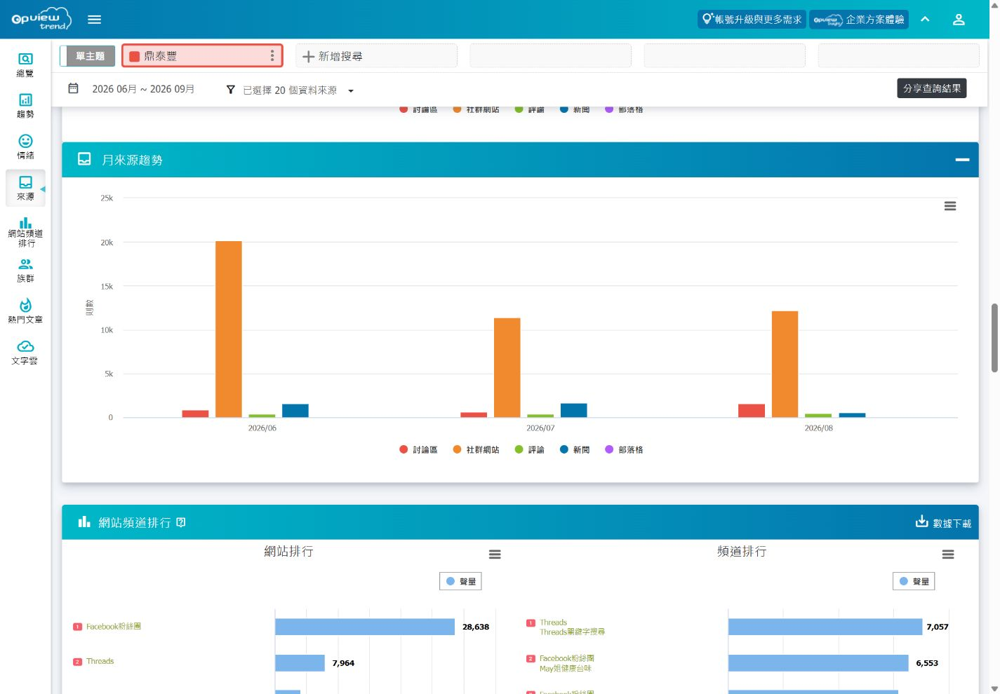

- 時間：2026-09-07 10:59:40（台北）。
- 網址：[操作頁](https://trend.opview.com.tw/trend/Result#section-source)。
- 條件：鼎泰豐；2026-06-01～2026-09-06（介面顯示2026-06～2026-09）；20項來源。
- 操作／可見狀態：展開月來源趨勢。
- 證據類型：完成畫面／可見入口；原尺寸 1425×990。
- 設計觀察：重用三平台source欄位，新增同scope來源桶；來源缺失單列，不增加本期平台邊界。

### 06-source-multi

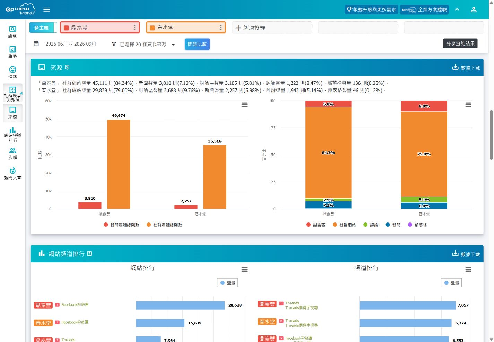

- 時間：2026-09-07 11:05:18（台北）。
- 網址：[操作頁](https://trend.opview.com.tw/trend/Result#section-source)。
- 條件：鼎泰豐＋春水堂；2026-06～2026-09；20項來源；是否完成以圖說為準。
- 操作／可見狀態：多主題來源比較。
- 證據類型：完成畫面／可見入口；原尺寸 1425×990。
- 設計觀察：重用三平台source欄位，新增同scope來源桶；來源缺失單列，不增加本期平台邊界。

### 06-source-week

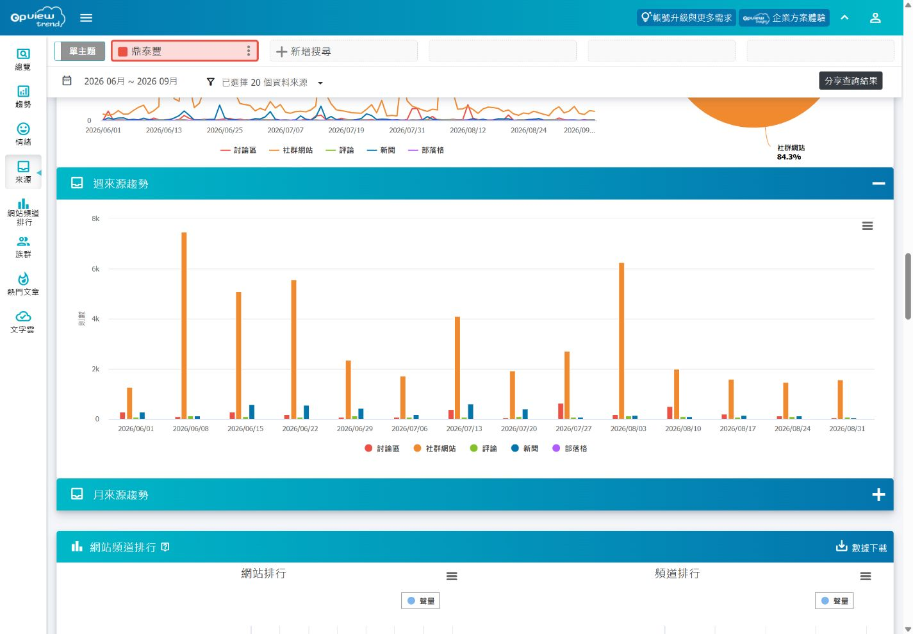

- 時間：2026-09-07 10:59:35（台北）。
- 網址：[操作頁](https://trend.opview.com.tw/trend/Result#section-source)。
- 條件：鼎泰豐；2026-06-01～2026-09-06（介面顯示2026-06～2026-09）；20項來源。
- 操作／可見狀態：展開週來源趨勢。
- 證據類型：完成畫面／可見入口；原尺寸 1425×990。
- 設計觀察：重用三平台source欄位，新增同scope來源桶；來源缺失單列，不增加本期平台邊界。

## 07 網站與頻道排行

**實際觀察與流程：** 網站／頻道兩張橫條圖並列，長排行分張保存；多主題以不同顏色呈現。獨立排序控制及點列下鑽未確認。

**本系統建議：** 新增channels聚合；source+board為鍵，Google使用目前商家，缺值顯示未知頻道；排序按樣本數，互動數另欄。 API、型別、相容策略與驗收案例見[詳細規格](opview-implementation-spec.md)。

### 07-channel-multi

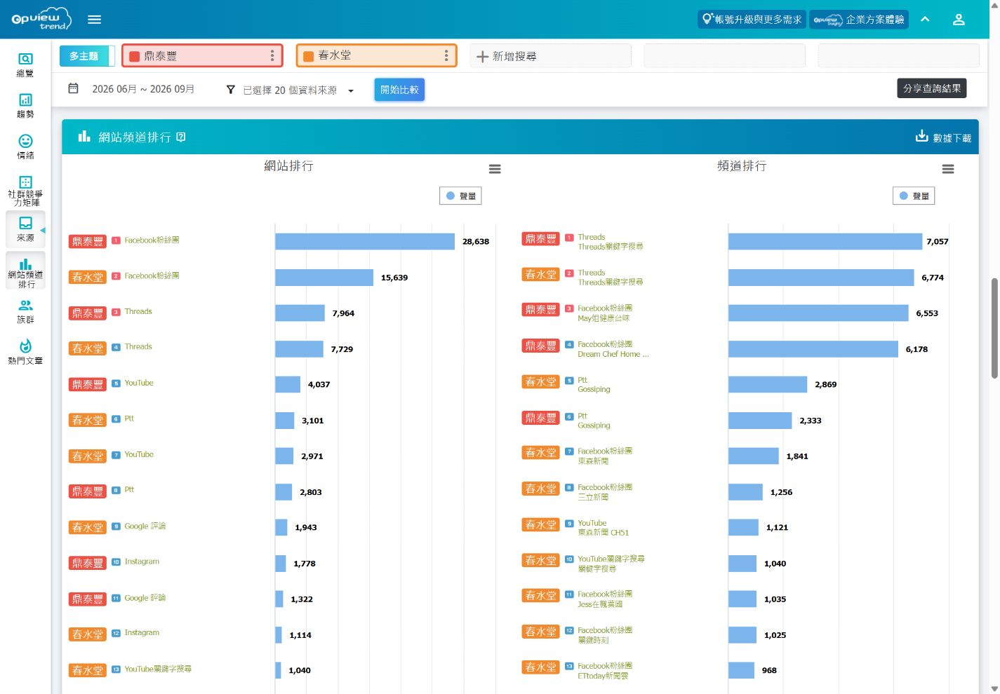

- 時間：2026-09-07 11:05:19（台北）。
- 網址：[操作頁](https://trend.opview.com.tw/trend/Result#section-channel)。
- 條件：鼎泰豐＋春水堂；2026-06～2026-09；20項來源；是否完成以圖說為準。
- 操作／可見狀態：多主題網站與頻道排行。
- 證據類型：完成畫面／可見入口；原尺寸 1425×990。
- 設計觀察：新增channels聚合；source+board為鍵，Google使用目前商家，缺值顯示未知頻道；排序按樣本數，互動數另欄。

### 07-channel-multi-lower

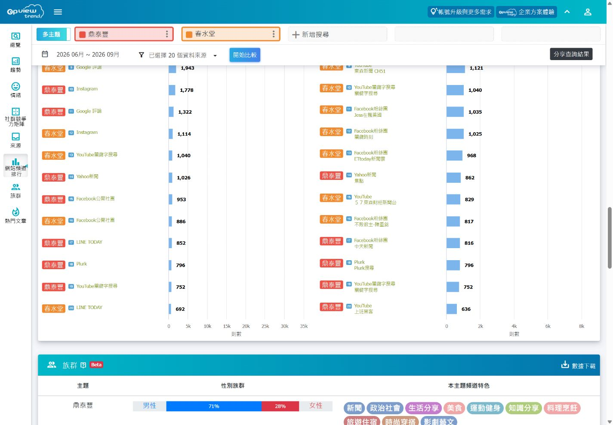

- 時間：2026-09-07 11:05:21（台北）。
- 網址：[操作頁](https://trend.opview.com.tw/trend/Result#section-channel)。
- 條件：鼎泰豐＋春水堂；2026-06～2026-09；20項來源；是否完成以圖說為準。
- 操作／可見狀態：排行後半部。
- 證據類型：完成畫面／可見入口；原尺寸 1425×990。
- 設計觀察：新增channels聚合；source+board為鍵，Google使用目前商家，缺值顯示未知頻道；排序按樣本數，互動數另欄。

### 07-channel-rankings

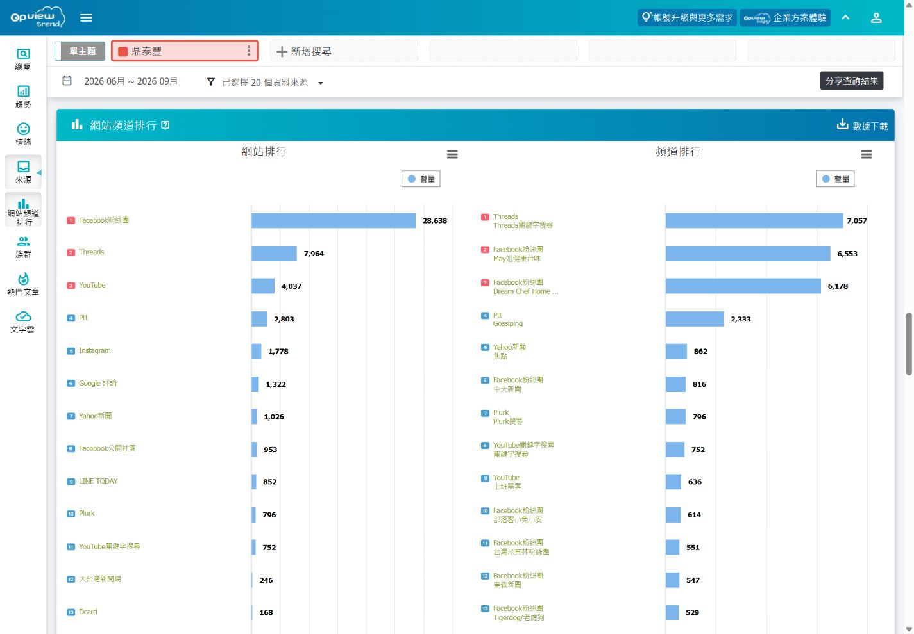

- 時間：2026-09-07 10:59:48（台北）。
- 網址：[操作頁](https://trend.opview.com.tw/trend/Result#section-channel)。
- 條件：鼎泰豐；2026-06-01～2026-09-06（介面顯示2026-06～2026-09）；20項來源。
- 操作／可見狀態：網站與頻道橫條排行。
- 證據類型：完成畫面／可見入口；原尺寸 1425×990。
- 設計觀察：新增channels聚合；source+board為鍵，Google使用目前商家，缺值顯示未知頻道；排序按樣本數，互動數另欄。

## 08 族群

**實際觀察與流程：** 性別比例、頻道特色標籤及Beta；多主題按品牌排列。說明提示未揭露推估模型或可靠度。

**本系統建議：** 暫緩人口推估；不能利用姓名或評論猜性別。來源與看板排行可提供可追溯的營運資訊。 API、型別、相容策略與驗收案例見[詳細規格](opview-implementation-spec.md)。

### 08-audience

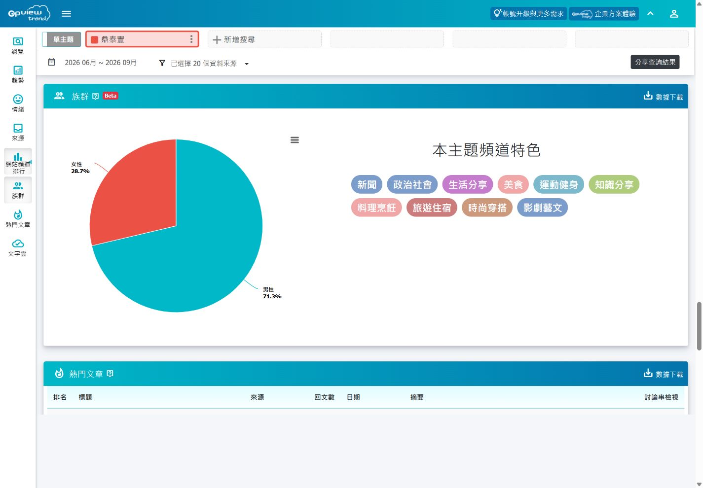

- 時間：2026-09-07 10:59:50（台北）。
- 網址：[操作頁](https://trend.opview.com.tw/trend/Result#section-audience)。
- 條件：鼎泰豐；2026-06-01～2026-09-06（介面顯示2026-06～2026-09）；20項來源。
- 操作／可見狀態：性別比例與頻道特色，Beta。
- 證據類型：完成畫面／可見入口；原尺寸 1425×990。
- 設計觀察：暫緩人口推估；不能利用姓名或評論猜性別。來源與看板排行可提供可追溯的營運資訊。

### 08-audience-help

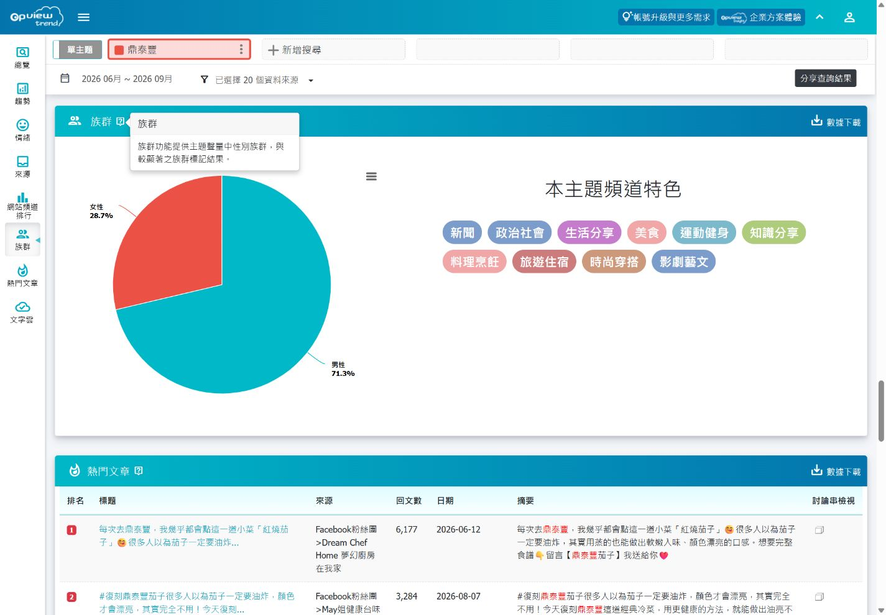

- 時間：2026-09-07 10:59:52（台北）。
- 網址：[操作頁](https://trend.opview.com.tw/trend/Result#section-audience)。
- 條件：鼎泰豐；2026-06-01～2026-09-06（介面顯示2026-06～2026-09）；20項來源。
- 操作／可見狀態：點族群說明圖示。
- 證據類型：完成畫面／可見入口；原尺寸 1425×990。
- 設計觀察：暫緩人口推估；不能利用姓名或評論猜性別。來源與看板排行可提供可追溯的營運資訊。

### 08-audience-multi

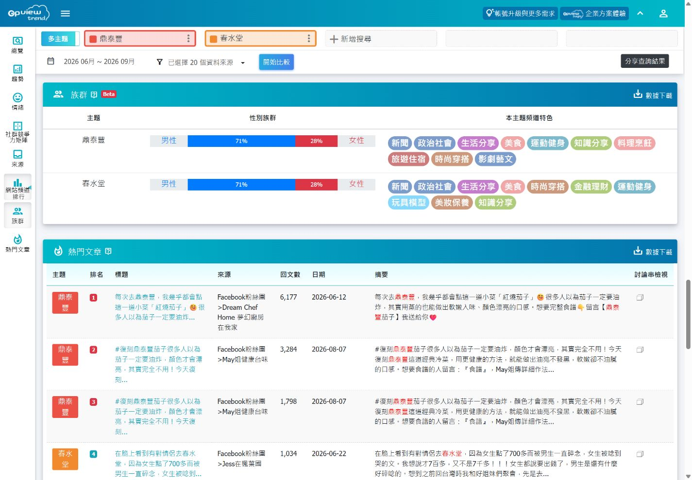

- 時間：2026-09-07 11:05:22（台北）。
- 網址：[操作頁](https://trend.opview.com.tw/trend/Result#section-audience)。
- 條件：鼎泰豐＋春水堂；2026-06～2026-09；20項來源；是否完成以圖說為準。
- 操作／可見狀態：多主題族群比较。
- 證據類型：完成畫面／可見入口；原尺寸 1425×990。
- 設計觀察：暫緩人口推估；不能利用姓名或評論猜性別。來源與看板排行可提供可追溯的營運資訊。

## 09 熱門文章與討論串

**實際觀察與流程：** 表格含標題摘要、回文數、頻道、日期及討論串入口。PTT主文與556回應載入成功；每頁50筆，第二頁51起，底部分頁12頁。多主題增加主題標示。

**本系統建議：** 重用熱門討論串與證據介面，補篩選、排序、分頁與快照中繼資料；平台回文數不能當作已蒐集回應筆數。 API、型別、相容策略與驗收案例見[詳細規格](opview-implementation-spec.md)。

### 09-articles

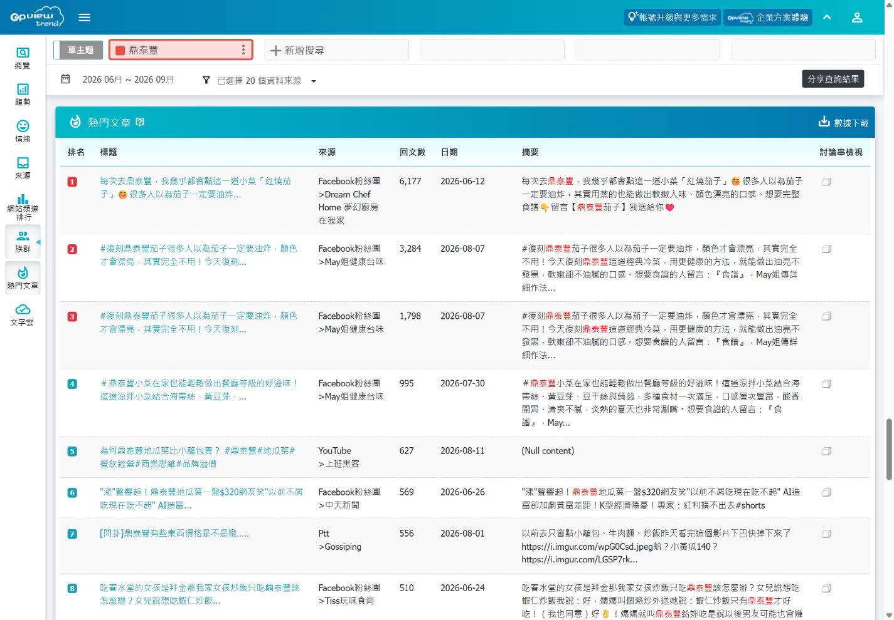

- 時間：2026-09-07 11:00:05（台北）。
- 網址：[操作頁](https://trend.opview.com.tw/trend/Result#section-articles)。
- 條件：鼎泰豐；2026-06-01～2026-09-06（介面顯示2026-06～2026-09）；20項來源。
- 操作／可見狀態：熱門文章表格，依回文数排行。
- 證據類型：完成畫面／可見入口；原尺寸 1425×990。
- 設計觀察：重用熱門討論串與證據介面，補篩選、排序、分頁與快照中繼資料；平台回文數不能當作已蒐集回應筆數。

### 09-articles-multi

- 時間：2026-09-07 11:05:34（台北）。
- 網址：[操作頁](https://trend.opview.com.tw/trend/Result#section-articles)。
- 條件：鼎泰豐＋春水堂；2026-06～2026-09；20項來源；是否完成以圖說為準。
- 操作／可見狀態：多主題熱門文章，品牌欄與同頁比較。
- 證據類型：完成畫面／可見入口；原尺寸 1425×990。
- 設計觀察：重用熱門討論串與證據介面，補篩選、排序、分頁與快照中繼資料；平台回文數不能當作已蒐集回應筆數。

### 09-articles-ptt

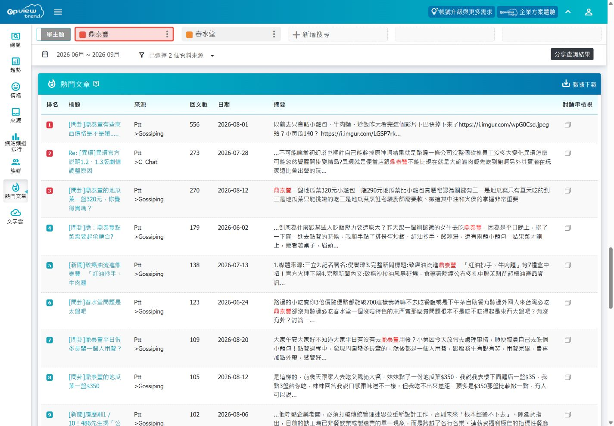

- 時間：2026-09-07 11:07:41（台北）。
- 網址：[操作頁](https://trend.opview.com.tw/trend/Result#section-articles)。
- 條件：鼎泰豐；2026-06～2026-09；僅PTT主文／回文。
- 操作／可見狀態：PTT-only熱門文章。
- 證據類型：完成畫面／可見入口；原尺寸 1425×990。
- 設計觀察：重用熱門討論串與證據介面，補篩選、排序、分頁與快照中繼資料；平台回文數不能當作已蒐集回應筆數。

### 09-thread-page2

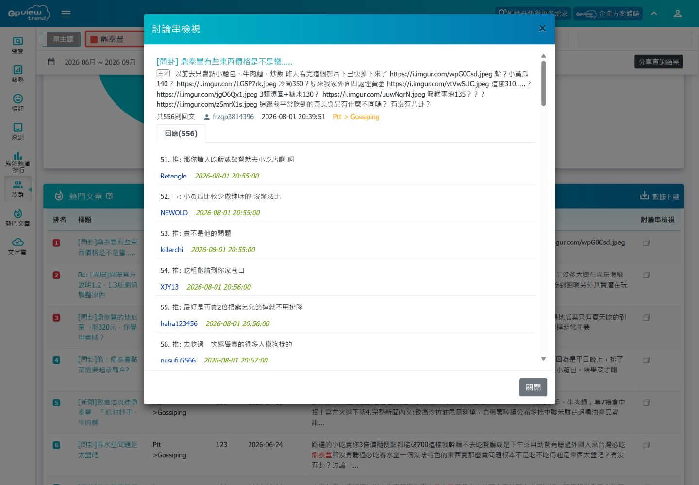

- 時間：2026-09-07 11:09:46（台北）。
- 網址：[操作頁](https://trend.opview.com.tw/trend/Result?page=2)。
- 條件：鼎泰豐；2026-06～2026-09；僅PTT主文／回文。
- 操作／可見狀態：PTT回應第2頁，序號51起，分頁成功。
- 證據類型：完成畫面／可見入口；原尺寸 1440×1000。
- 設計觀察：重用熱門討論串與證據介面，補篩選、排序、分頁與快照中繼資料；平台回文數不能當作已蒐集回應筆數。

### 09-thread-pagination

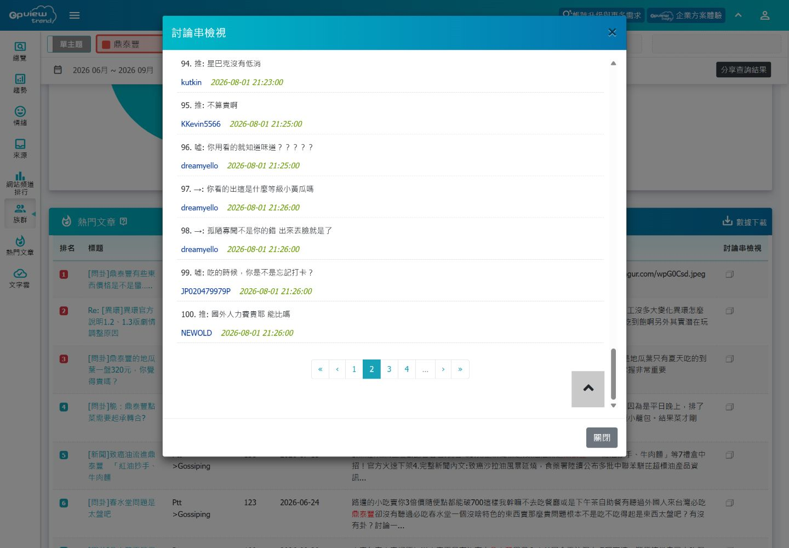

- 時間：2026-09-07 11:09:56（台北）。
- 網址：[操作頁](https://trend.opview.com.tw/trend/Result?page=2)。
- 條件：鼎泰豐；2026-06～2026-09；僅PTT主文／回文。
- 操作／可見狀態：討論串第2頁底部：每頁50則，上一頁／下一頁／末頁。
- 證據類型：完成畫面／可見入口；原尺寸 1440×1000。
- 設計觀察：重用熱門討論串與證據介面，補篩選、排序、分頁與快照中繼資料；平台回文數不能當作已蒐集回應筆數。

### 09-thread-ptt-loaded

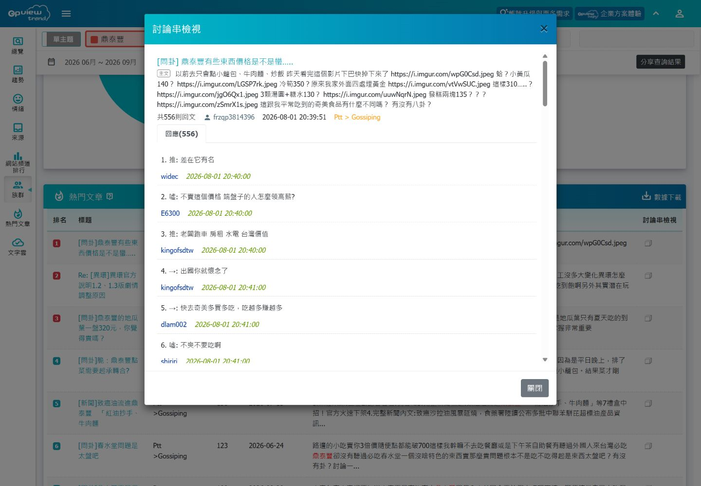

- 時間：2026-09-07 11:09:36（台北）。
- 網址：[操作頁](https://trend.opview.com.tw/trend/Result#active)。
- 條件：鼎泰豐；2026-06～2026-09；僅PTT主文／回文。
- 操作／可見狀態：PTT討論串完成：主文、556回應、作者與時間；原站公開內容，並非本機系統資料。
- 證據類型：完成畫面／可見入口；原尺寸 1440×1000。
- 設計觀察：重用熱門討論串與證據介面，補篩選、排序、分頁與快照中繼資料；平台回文數不能當作已蒐集回應筆數。

