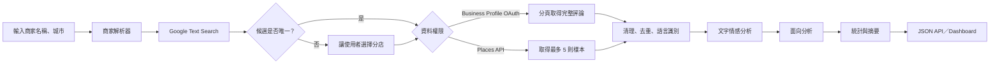

可以做。建議把它設計成「可替換資料來源的評論分析 Agent」，不要直接依賴 Google Maps 網頁 DOM 爬蟲。

最重要的限制是：

- 任意商家：官方 Places API 最多只回傳 5 則評論，只適合快速摘要，無法代表全部評論。[Places API 說明](https://developers.google.com/maps/documentation/places/web-service/reference/rest/v1/places)
- 自己或客戶授權管理的已驗證商家：Google Business Profile API 可以分頁取得評論，每頁最多 50 則，需要 OAuth 與 API 使用資格。[Reviews API](https://developers.google.com/my-business/reference/rest/v4/accounts.locations.reviews/list)
- Google 現行條款明確限制爬取、複製及儲存 Google Maps 評論，所以不建議用 Playwright、Selenium 或 BeautifulSoup 直接爬 Google Maps。[Google Maps Platform 條款](https://cloud.google.com/maps-platform/terms?hl=en-EN)

因此，若目標是「完整評論情感分析」，建議 MVP 以有管理權限的商家為主。

## 建議架構



Agent 不需要一開始就導入複雜框架。先用 Python 實作明確的狀態機：

```text
PENDING
→ RESOLVING_BUSINESS
→ WAITING_FOR_SELECTION
→ FETCHING_REVIEWS
→ ANALYZING
→ GENERATING_REPORT
→ COMPLETED / FAILED
```

Agent 內部提供五個固定工具：

1. `resolve_business()`：商家名稱解析成 Place ID。
2. `fetch_reviews()`：依權限選擇 Places 或 Business Profile Provider。
3. `analyze_sentiment()`：逐則情感分類。
4. `extract_aspects()`：服務、價格、環境、餐點、等待時間等面向。
5. `aggregate_report()`：產生統計、趨勢、摘要及改善建議。

## 商家解析

使用 Places Text Search：

```http
POST https://places.googleapis.com/v1/places:searchText
```

輸入最好不要只有商家名稱，至少包含：

```json
{
  "business_name": "王品牛排",
  "city": "台北市",
  "address_hint": "中山區",
  "language": "zh-TW"
}
```

Text Search 支援位置限制、位置偏好及 Field Mask，可以降低同名商家與分店辨識錯誤。[Text Search 官方文件](https://developers.google.com/maps/documentation/places/web-service/text-search)

如果前兩名候選分數太接近，不讓 Agent 自行猜測，回傳候選分店給使用者選擇。選好後保存 `place_id`，後續不要再次靠名稱搜尋。

## 情感分析策略

建議採混合式設計：

- 本地多語言 Transformer：負責每一則評論的正面／中立／負面分類。
- LLM：負責面向抽取、混合情緒判斷、摘要及改善建議。
- 低信心評論才送 LLM，可以顯著降低成本。

每則分析結果：

```json
{
  "sentiment": "negative",
  "confidence": 0.91,
  "rating": 2,
  "rating_text_conflict": false,
  "aspects": [
    {
      "name": "service",
      "sentiment": "negative",
      "confidence": 0.94
    },
    {
      "name": "food",
      "sentiment": "positive",
      "confidence": 0.78
    }
  ],
  "language": "zh-TW"
}
```

注意事項：

- 星等和文字情緒要分開保存。例如五星評論也可能包含抱怨。
- 沒有文字的評論標記為 `rating_only`，不要送文字模型。
- 保留原始文字，不要先翻譯再分類；多語言模型通常比較能保留語氣。
- Google Maps 內容不應拿來訓練、微調或驗證模型；如需微調，使用取得授權的資料集。
- Places API 模式只有 5 則時，報告必須明確標記為「樣本摘要」，不能宣稱代表整體。

## 技術選型

- Python 3.12
- uv：環境、依賴與 lockfile
- FastAPI：REST API
- Pydantic Settings：設定與資料驗證
- httpx：非同步 Google API client
- tenacity：429、5xx 重試
- PostgreSQL、SQLAlchemy、Alembic
- Redis + arq：需要背景任務時再加入
- transformers、PyTorch：本地情感模型
- pytest、respx：測試 API client
- Ruff、mypy：品質檢查

uv 會以 `pyproject.toml` 管理依賴並產生可重現的 `uv.lock`。[uv 專案指南](https://docs.astral.sh/uv/guides/projects/)

初始化方式：

```powershell
uv init --package google-review-agent
cd google-review-agent
uv python pin 3.12

uv add fastapi "uvicorn[standard]" httpx pydantic-settings
uv add sqlalchemy asyncpg alembic tenacity orjson
uv add redis arq
uv add transformers torch sentencepiece lingua-language-detector

uv add --dev pytest pytest-asyncio respx ruff mypy
```

## 專案目錄

```text
google-review-agent/
├── pyproject.toml
├── uv.lock
├── src/review_agent/
│   ├── api.py
│   ├── config.py
│   ├── domain/
│   │   ├── models.py
│   │   └── schemas.py
│   ├── providers/
│   │   ├── base.py
│   │   ├── google_places.py
│   │   └── google_business_profile.py
│   ├── services/
│   │   ├── business_resolver.py
│   │   ├── review_collector.py
│   │   ├── sentiment.py
│   │   ├── aspect_analyzer.py
│   │   ├── aggregator.py
│   │   └── orchestrator.py
│   ├── repositories/
│   └── workers/
└── tests/
```

## API 規劃

```text
POST /v1/businesses/resolve
POST /v1/analyses
GET  /v1/analyses/{job_id}
GET  /v1/analyses/{job_id}/report

GET  /auth/google/start
GET  /auth/google/callback

GET  /healthz
```

報告建議提供：

- 正面／中立／負面比例
- 平均星等與文字情感的落差
- 各面向滿意度
- 每週或每月趨勢
- 最常出現的抱怨與稱讚
- 具體改善建議
- 分析樣本數、時間範圍及模型版本

## 資料與安全

Places API 模式應盡量即時處理，避免長期保存評論原文；若要展示評論，還必須保留作者歸屬與 Google Maps 原始連結。[Places API 政策](https://developers.google.com/maps/documentation/places/web-service/policies?hl=en)

Business Profile 模式則應：

- 加密保存 OAuth refresh token。
- 不在 log 中記錄評論全文或 Token。
- 使用來源 review ID 去重。
- 支援增量同步與分頁 checkpoint。
- 設定原文保存期限與刪除機制。
- API Key 僅放後端環境變數，不傳到前端。

## 建議 MVP 範圍

第一版先完成：

1. 輸入商家名稱與城市。
2. 顯示候選分店並選擇。
3. 串接一個 Review Provider。
4. 分析正／中／負面與五個固定面向。
5. 回傳 JSON 報告。
6. 加入重試、去重與基本測試。

先不要做 Dashboard、向量資料庫或複雜 Agent 框架。等資料來源與分析準確度穩定，再加入對話式查詢、競品比較及定期監控。