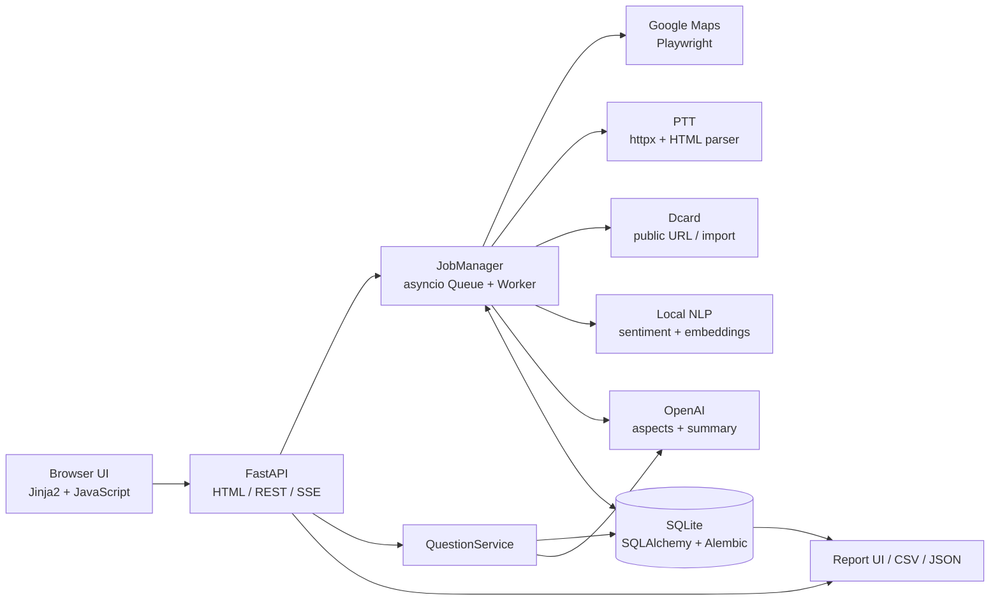
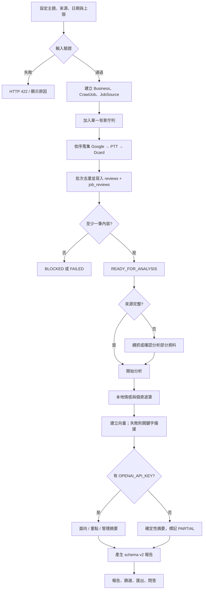
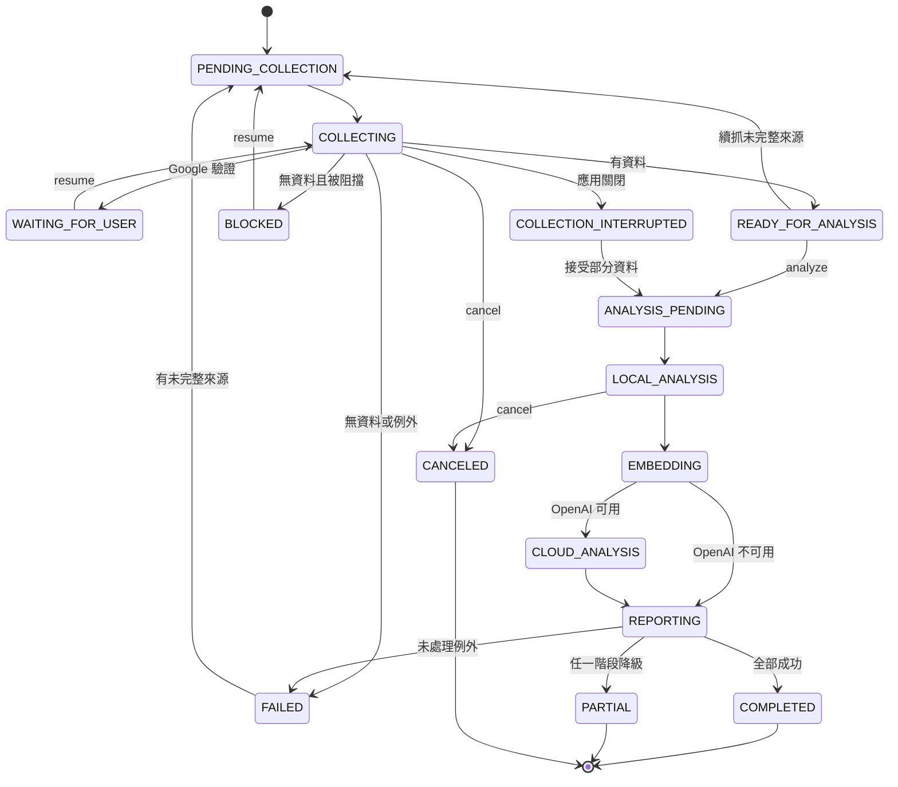
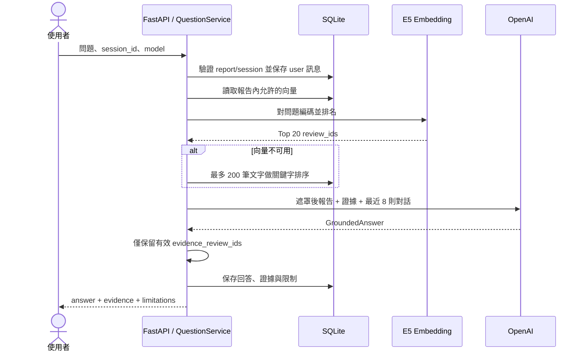
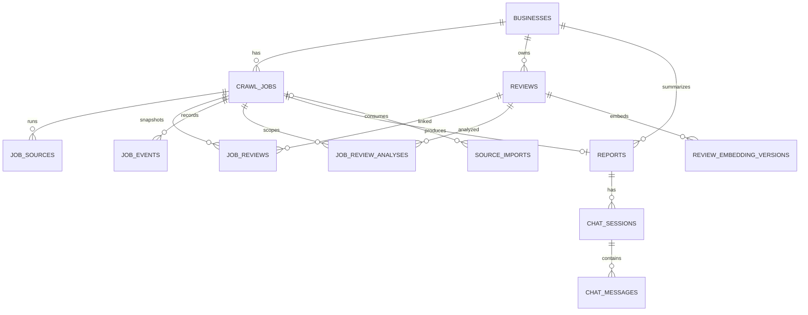

# 2026-09-07 決策升級增補

本次新增內容以 [決策升級使用與設計](docs/decision-upgrade.md) 為現行規格：報告 schema v3、Alembic 0005、主題與時間趨勢、Multi-Agent 決策流程、工作追蹤、專家評估及品牌比較。保留 FastAPI／SQLite 本機架構。

原先「蒐集後一定人工確認」改為預設人工確認，另可明確勾選自動接續並接受部分資料。新增資料表與 API、降級／重試／排程語意、評估邊界均列於增補文件。未實際完成 OpView 試用或真人盲評。

以下為 2026-08-24 的原始設計基線；與本增補衝突時以本增補為準，當時的資料庫盤點不代表目前使用者資料庫已執行升級。

---

> 由 DOCX 轉換而成的 Markdown 版本。Mermaid 原始碼保留為可直接貼入 Mermaid Live Editor 或文件工具的 fenced code block。

## SYSTEM ANALYSIS & DESIGN

# 跨平台口碑分析系統

## 系統分析與設計文件

| 文件資訊 | 內容 |
| --- | --- |
| 系統版本 | simpsons-insight-agent 0.2.0 |
| 盤點日期 | 2026-08-24（Asia/Taipei） |
| 分析基準 | 目前工作區程式碼、Alembic 0001–0004 與 data/reviews.db 實際 schema |
| 文件定位 | 供產品、開發、維運與後續接手人員使用的現況設計基線 |
| 主要技術 | Python 3.12、FastAPI、SQLAlchemy Async、SQLite、Playwright、Transformers、OpenAI |

> **一句話說明**
> 本系統在 Windows 本機蒐集 Google Maps、PTT 與 Dcard 的公開口碑內容，將資料蒐集與分析刻意拆成兩階段，完成本地情感、跨平台統計、OpenAI 面向摘要與有證據限制的報告問答。

# 文件摘要

本文件描述的是目前已實作的系統，不是理想化藍圖。功能、狀態、API、資料表與刪除行為均以程式碼、遷移檔及現有 SQLite schema 交叉核對；README 僅作為使用情境補充。

## 核心設計判斷

- 一個任務以商家或品牌主題為中心，最多同時配置 Google Maps、PTT、Dcard 各一個來源。

- 蒐集與分析分離：先確認資料範圍，再由使用者明確啟動分析；部分來源失敗時，其他來源繼續。

- 所有評論、文章、留言逐筆等權；Google 星等只影響 Google 資料，Dcard 互動數僅作熱度。

- 同一主題的內容可跨任務重用；分析結果則以 job_id + review_id 隔離，避免不同任務互相覆蓋。

- 系統綁定 127.0.0.1，無登入與授權機制；它是本機工具，不應直接暴露到公網。

## 文件章節

| 章 | 內容 |
| --- | --- |
| 1 | 系統背景、範圍與角色 |
| 2 | 功能需求與使用情境 |
| 3 | 系統架構與模組設計 |
| 4 | 核心流程與 Mermaid 圖 |
| 5 | API 與資料契約 |
| 6 | 資料庫設計、ER 圖與資料字典 |
| 7 | 隱私、安全、例外與非功能需求 |
| 8 | 部署、設定、測試與改善建議 |

# 1. 系統背景、目標與範圍

## 1.1 系統目標

將分散於 Google Maps、PTT、Dcard 的口碑資料聚合到同一主題，保留來源差異與內容型態，提供可續抓、可降級、可追溯的蒐集分析工作流。

## 1.2 範圍內

- Google Maps 店家搜尋、分店選定、評論排序、捲動蒐集、人工 CAPTCHA 接手與診斷資料。

- PTT 指定看板與關鍵字標題搜尋，文章與推／噓／箭頭解析。

- Dcard 指定公開文章 URL 解析，以及 CSV／JSON 驗證後匯入。

- 跨來源內容去重、任務 checkpoint、本地情感與語言偵測、向量建立、OpenAI 面向與摘要。

- 報告瀏覽、來源／內容／情緒／星等／面向／文字篩選、CSV／JSON 匯出與證據式問答。

## 1.3 明確不在範圍內

- 不提供代理池、stealth、帳號輪替、CAPTCHA 自動繞過或封鎖規避。

- 不登入 Dcard、不搜尋 Dcard 全站、不呼叫未公開 API，也不自動翻頁擴張 URL 範圍。

- 不將整體情緒比例解讀為母體民調；不同平台受眾與內容型態有選樣偏差。

- 不提供多人帳號、租戶隔離、權限控管、外網部署或集中式工作排程。

## 1.4 角色

| 角色 | 主要操作 | 系統回應 |
| --- | --- | --- |
| 分析操作人員 | 設定主題、來源與範圍；續抓／分析／取消／刪除 | 任務狀態、來源進度、報告 |
| 報告讀者 | 檢視整體與來源洞察、篩選內容、匯出 | 統計、代表內容、管理摘要 |
| 研究／客服人員 | 用自然語言追問報告 | 回答、證據 review_ids 與限制 |
| 維運／開發人員 | 啟動、遷移、設定模型、查看診斷與測試 | healthz、事件、log、診斷檔 |

# 2. 功能需求與使用情境

| 功能 | 目前實作 |
| --- | --- |
| F01 主題設定 | 建立 business 或 brand，保存名稱、地址、別名；以 subject_key 或 maps_url 重用主題。 |
| F02 Google 搜尋 | 關鍵字或 Maps URL 搜尋候選分店，回傳名稱、地址、星等、評論總數與 URL。 |
| F03 多來源配置 | 每任務最多 Google/PTT/Dcard 各一組；共同關鍵字預設由名稱與別名產生。 |
| F04 Dcard 匯入 | 下載範本、上傳 UTF-8 CSV/JSON、整批驗證、作者 HMAC、錯誤時 HTTP 422。 |
| F05 背景蒐集 | 單一 asyncio worker，按 Google→PTT→Dcard 順序執行；批次持久化與 SSE 狀態更新。 |
| F06 續抓與 checkpoint | 從既有 job_reviews、source_item_id/content_hash 與 provider checkpoint 去重重試。 |
| F07 人工驗證 | 可見 Google 瀏覽器遇阻擋時進 WAITING_FOR_USER；無頭模式直接回報 BLOCKED。 |
| F08 部分成功 | 個別來源 PARTIAL/BLOCKED/FAILED 不阻止其他來源；有任何資料即可選擇分析。 |
| F09 任務控制 | 支援取消、續抓、啟動分析、刪除；刪除會等待 active job 安全停止最多 30 秒。 |
| F10 本地分析 | 多語情感模型、台灣用語與星等校準、PTT 短推噓規則、語言偵測與 PII 遮罩。 |
| F11 向量與問答檢索 | 以 multilingual-e5-small 建 passage/query embedding；失敗時使用關鍵字排序。 |
| F12 OpenAI 分析 | 固定面向、重點、管理摘要及證據式問答；未設定 API Key 時保留本地報告並標 PARTIAL。 |
| F13 報告 | schema_version 2：整體／來源統計、內容組成、趨勢、衝突、熱門串、代表內容與摘要。 |
| F14 篩選與匯出 | 逐筆內容依負面優先；可篩來源、類型、情緒、星等、面向與關鍵字；匯出 CSV/JSON。 |
| F15 報告追問 | 同一 session 保存最近對話；Top 20 本機證據傳入 OpenAI，並驗證 evidence IDs。 |
| F16 啟動復原 | 啟動時將中斷的蒐集標為 COLLECTION_INTERRUPTED，分析階段回到 ANALYSIS_PENDING。 |

## 2.1 來源規則與限制

| 來源 | 輸入 | 限制與停止 | 作者／訊號 |
| --- | --- | --- | --- |
| Google Maps | 店家 URL；1–500；newest/relevant；headless | target_reached、total_reached、no_growth；阻擋時人工接手或 BLOCKED | author_name 本機保存；rating 與 owner_reply；星等校準 |
| PTT | 1–10 看板、1–10 關鍵字、日期、文章/推文上限 | 固定單連線與至少 1 秒間隔；最多翻 20 頁；尊重 Retry-After；403 不繞過 | 作者即時 HMAC；push/boo/neutral；短推噓可覆蓋情感 |
| Dcard | 最多 50 URL 或 20 import_ids、日期、文章/留言上限、條款確認 | 只允許標準 HTTPS 公開文章；跨域/非標準 port 重新導向拒絕；公開頁不完整為 PARTIAL | 作者即時 HMAC；reaction_count 只作熱度 |

# 3. 系統架構與模組設計


*圖 1　目前系統的本機單體架構（Mermaid 原始碼見 4.1）*

## 3.1 架構特性

- 本機單體應用：FastAPI 同時提供 HTML、靜態資源與 JSON/SSE API。

- 工作佇列為記憶體 asyncio.Queue，僅一個 worker；程序重啟依資料庫狀態重新排入待辦。

- 來源供應器抽象統一 collect(config, checkpoint, callbacks)，Google 另受 browser_lock 保護。

- SQLite 啟用 foreign_keys=ON 與 WAL；所有 ORM 操作採 SQLAlchemy AsyncSession。

- 報告 payload 是 materialized JSON 快照，逐筆內容與分析仍保存在正規化資料表供篩選與證據檢索。

## 3.2 元件責任

| 元件 | 檔案／技術 | 責任 |
| --- | --- | --- |
| Web/API | api.py、FastAPI、Jinja2 | 生命週期、HTML、REST、SSE、匯出與例外轉換 |
| 工作編排 | jobs.py、asyncio.Queue | 建立任務、來源循序執行、checkpoint、分析階段與刪除 |
| Google 蒐集 | scraper.py、sources.py、Playwright | 搜尋候選、persistent context、DOM 解析、捲動、診斷 |
| 論壇蒐集 | forum_sources.py、httpx、HTMLParser | PTT 搜尋/文章解析、Dcard 公開頁解析、安全 URL fetch |
| 匯入 | imports.py | Dcard CSV/JSON schema、大小、列數、URL、ISO 8601 與整批錯誤 |
| 本地 NLP | sentiment.py、embeddings.py | 情感、語言、校準、向量編碼與 cosine 排名 |
| 雲端分析 | cloud.py、OpenAI structured output | 固定面向、重點、管理摘要與 GroundedAnswer |
| 報告 | reporting.py、report.html/report.js | 確定性統計、代表案例、分頁篩選、匯出與呈現 |
| 問答 | qa.py | 會話、向量/關鍵字檢索、證據驗證與訊息保存 |
| 資料層 | models.py、db.py、Alembic | 資料模型、WAL、外鍵、schema revision 與啟動復原 |
| 隱私 | author_privacy.py、privacy.py | HMAC 作者假名、PII 遮罩、OpenAI payload 深層清理 |

## 3.3 關鍵資料流

| 資料 | 本機保存 | 傳往 OpenAI |
| --- | --- | --- |
| 來源內容 | 原文、遮罩後文字、來源 URL、平台欄位 | 匿名 review_key、source、content_type、遮罩標題/文字、日期、Google rating |
| 作者 | Google 可有 author_name；PTT/Dcard 僅 author_hash | 不傳 author、author_hash、author_name |
| 定位資訊 | maps_url、source_url、address、board/forum | sanitize_for_openai 移除 |
| 分析 | 本地情緒、分數、向量、OpenAI 面向與重點 | 雲端輸出回寫 job_review_analyses/reports/chat_messages |

# 4. 核心流程與 Mermaid 圖

## 4.1 系統元件流程



## 4.2 端到端任務流程


*圖 2　從任務設定到報告使用的端到端流程*



## 4.3 任務狀態機

狀態不是單純線性：蒐集可因人工驗證、應用關閉或部分來源失敗停在可恢復節點；分析則以 last_completed_stage 避免重做已完成的大階段。



## 4.4 報告問答流程


*圖 3　報告追問的本機檢索、雲端回答與證據保存*



## 4.5 例外與降級流程

| 情境 | 處理 | 最終可見狀態 |
| --- | --- | --- |
| Google CAPTCHA／異常流量 | 可見模式等待人工驗證；無頭模式不繞過 | WAITING_FOR_USER 或來源 BLOCKED/PARTIAL |
| 單一來源阻擋或例外 | 保存已取得資料、記錄 stop_reason/error，繼續後續來源 | READY_FOR_ANALYSIS（若總數>0） |
| 所有來源無資料 | 依是否被阻擋決定 BLOCKED 或 FAILED | 不能開始分析 |
| 本地情感模型不可用 | 以 heuristic-fallback；報告仍產生 | PARTIAL，degraded_reasons 記錄筆數 |
| Embedding 失敗 | 略過向量；問答改以最多 200 筆文字關鍵字排序 | PARTIAL |
| 未設定／OpenAI 失敗 | 保留本地情感與確定性摘要；面向可能空白 | PARTIAL |
| 應用在蒐集中關閉 | 啟動時轉 COLLECTION_INTERRUPTED；來源 COLLECTING→PARTIAL | 可續抓或分析部分資料 |
| 應用在分析中關閉 | 轉回 ANALYSIS_PENDING，從 last_completed_stage 接續 | 自動重新排隊 |

# 5. API 與資料契約

## 5.1 頁面與健康檢查

| Method / Path | 用途 | 回應 |
| --- | --- | --- |
| GET / | 最近 20 個任務與建立任務 UI | HTML |
| GET /reports/{report_id} | 報告 UI；舊 payload 讀取時轉 schema v2 | HTML / 404 |
| GET /healthz | 執行簡單 DB count 驗證連線 | {status: ok} |

## 5.2 REST / SSE API

| Method | Path | 輸入／行為 | 回應 |
| --- | --- | --- | --- |
| POST | /api/businesses/search | 相容別名；query/headless | 候選商家 |
| POST | /api/sources/google-maps/search | Maps 搜尋；query 2–500 字 | BusinessSearchResponse / 502 |
| GET | /api/source-imports/dcard/template | format=csv\|json | 範本下載 |
| POST | /api/source-imports/dcard | multipart file；最大 10 MB | 201 SourceImportResponse / 422 |
| POST | /api/jobs | CreateJobRequest；多來源或舊 Google-only | 202 JobResponse / 422 |
| GET | /api/jobs/{id} | 任務、來源、可續抓／分析能力 | JobResponse / 404 |
| GET | /api/jobs/{id}/events | 每 0.75 秒比較狀態，只在變更時送出 | text/event-stream |
| POST | /api/jobs/{id}/resume | 人工驗證繼續或未完整來源重新排隊 | JobResponse / 404 / 409 |
| POST | /api/jobs/{id}/analyze | llm_model、accept_partial_collection | 202 JobResponse / 404 / 409 |
| POST | /api/jobs/{id}/cancel | 設定 cancel_requested | JobResponse / 404 |
| DELETE | /api/jobs/{id} | 刪任務與任務獨有爬文資料 | 204 / 404 / 409 |
| GET | /api/reports/{id} | 報告 JSON | ReportResponse / 404 |
| GET | /api/reports/{id}/items | review_id/source/type/sentiment/rating/aspect/q/page | PaginatedReviews |
| GET | /api/reports/{id}/reviews | items 的相容別名 | PaginatedReviews |
| GET | /api/reports/{id}/export | format=csv\|json | 下載內容 |
| POST | /api/reports/{id}/questions | question/session_id/llm_model | QuestionResponse / 404 / 422 / 503 |

## 5.3 核心驗證規則

| 契約 | 重要規則 |
| --- | --- |
| CreateJobRequest | sources 最多 3；同來源不可重複；多來源必須有 subject；llm_model 僅允許設定中的兩個模型。 |
| GoogleMapsSourceConfig | URL 必須是 Google Maps/允許的短網址；max_reviews 1–500；sort newest/relevant。 |
| PttSourceConfig | 看板 1–10 且符合 [A-Za-z0-9_-]；關鍵字 1–10；日期順序正確；上限 200 篇/2000 推文。 |
| DcardSourceConfig | 至少一個 URL 或 import_id；URL 嚴格限制 www.dcard.tw/f/{forum}/p/{id}；必須 acknowledge_terms。 |
| Dcard import | 欄位集合完全一致；UTF-8；最多 2100 列；任何一列錯誤整批失敗；published_at ISO 8601。 |
| StartAnalysisRequest | 來源未完整時必須 accept_partial_collection=true；零資料不可分析。 |
| QuestionRequest | 問題 2–2000 字；session 必須屬於指定 report；未設定 OpenAI API Key 回 503。 |

## 5.4 報告 schema_version 2

reports.payload 是讀取效率優先的 JSON 快照，主要鍵如下；舊版 payload 只在 API/頁面讀取時轉接，不會原地改寫資料庫。

| Key | 內容 |
| --- | --- |
| schema_version | 固定 2 |
| subject / business | 主題基本資料；保留相容鍵 |
| overall | sample_size、情緒、Google 星等、面向、月趨勢、代表內容、常見稱讚/抱怨 |
| sources | 每來源同型統計 |
| content_types / platform_signals | review/post/comment 組成與 PTT 訊號 |
| top_threads | 依 reaction_count 與內容數排序前 10 討論串 |
| collection | 總體與各來源 target/actual/status/complete/stop_reason/error |
| sentiment_analysis | 狀態、文字數、rating_only 數與本地模型 ID |
| review_ids / item_ids | 報告允許內容集合；item_ids 為相容別名 |
| executive | summary、strengths、weaknesses、risks、recommendations、source_differences |
| llm_model / generated_at | 雲端模型與產生時間 |

# 6. 資料庫設計

> **資料庫結論**
> 目前使用 SQLite + aiosqlite，啟用外鍵與 WAL；預期 Alembic revision 為 0004_multi_source。現有資料庫含 12 個現行業務表、2 個 migration 後保留的舊表，以及 alembic_version。

## 6.1 ER 關聯（Mermaid）



## 6.2 關聯與刪除語意

- Business 是主題根；刪除 business 會由外鍵連鎖刪除其 jobs 與 reviews，但目前 UI 的刪任務不刪 business。

- JobReview 將可跨任務重用的 Review 固定為任務樣本；ReviewAnalysis 則按任務隔離。

- 刪除任務會先停止 active job，再顯式刪分析、事件、連結、已綁定匯入、來源執行與報告；只刪沒有其他任務連結的 Review 與其 embeddings。

- Report 刪除後，chat_sessions 與 chat_messages 透過外鍵 CASCADE 刪除。

- source_imports 的 schema 外鍵是 SET NULL，但目前 delete_job 會主動刪除綁定該任務的批次；未綁定的 INVALID 匯入紀錄會保留。

## 6.3 現況資料量快照

以下僅列 2026-08-24 盤點時的筆數，不含任何原文或個資。

| 資料表 | 筆數 | 說明 |
| --- | --- | --- |
| businesses | 3 | 主題 |
| crawl_jobs | 5 | 任務 |
| job_sources | 5 | 來源執行 |
| reviews | 617 | 內容快照 |
| job_reviews | 718 | 任務樣本連結 |
| job_review_analyses | 618 | 任務範圍分析；同一 review 可跨 job 重複 |
| review_embedding_versions | 308 | 向量 |
| reports | 4 | 報告 |
| job_events | 20 | 事件 |
| source_imports | 0 | 匯入批次 |
| chat_sessions / chat_messages | 0 / 0 | 問答 |
| review_analyses / review_embeddings | 0 / 0 | 舊版殘留表 |

## 6.4 資料表總覽

| 表 | 狀態 | 用途 |
| --- | --- | --- |
| businesses | 現行 | 分析主題／商家主檔 |
| crawl_jobs | 現行 | 蒐集與分析任務主檔 |
| job_sources | 現行 | 每任務每來源的設定與 checkpoint |
| reviews | 現行 | 跨平台內容快照（評論、文章、留言） |
| source_imports | 現行 | Dcard CSV／JSON 匯入批次 |
| job_reviews | 現行 | 任務與內容多對多快照 |
| job_events | 現行 | 蒐集批次與診斷事件 |
| job_review_analyses | 現行 | 任務範圍的逐筆分析 |
| reports | 現行 | 任務報告（schema_version 2 JSON） |
| review_embedding_versions | 現行 | 內容向量版本 |
| chat_sessions | 現行 | 報告問答工作階段 |
| chat_messages | 現行 | 問答訊息與證據鏈 |
| review_analyses | 舊版殘留 | 舊版以 review 為唯一範圍的分析表；現行 ORM 不讀寫 |
| review_embeddings | 舊版殘留 | 舊版每內容單一向量；現行 ORM 不讀寫 |
| alembic_version | 基礎設施 | 資料庫遷移版本 |

## 6.5 資料字典

### 6.5.1 businesses

現行｜分析主題／商家主檔

| 欄位／限制 | 型別 | 鍵／空值 | 說明 |
| --- | --- | --- | --- |
| id | VARCHAR(36) | PK, NOT NULL | UUID 主鍵 |
| maps_url | TEXT | UQ, NULL | Google Maps URL；非 Google 主題可空 |
| name | VARCHAR(500) | NOT NULL | 主題名稱 |
| subject_kind | VARCHAR(20) | NOT NULL | business 或 brand |
| aliases | JSON | NOT NULL | 別名陣列 |
| subject_key | VARCHAR(64) | UQ, NULL | kind/name/address 的穩定 SHA-256 鍵 |
| address | TEXT | NULL | 城市或地址 |
| average_rating | FLOAT | NULL | Google 平均星等 |
| total_review_count | INTEGER | NULL | Google 可見總評論數 |
| created_at / updated_at | DATETIME | NOT NULL | 建立與更新時間 |

### 6.5.2 crawl_jobs

現行｜蒐集與分析任務主檔

| 欄位／限制 | 型別 | 鍵／空值 | 說明 |
| --- | --- | --- | --- |
| id | VARCHAR(36) | PK | 任務 UUID |
| business_id | VARCHAR(36) | FK, NOT NULL | → businesses.id；ON DELETE CASCADE |
| status | VARCHAR(40) | IDX, NOT NULL | 任務狀態 |
| max_reviews | INTEGER | NOT NULL | 各來源目標數加總；沿用舊欄名 |
| sort_order / headless | VARCHAR / BOOLEAN | NOT NULL | Google 相容設定 |
| llm_model | VARCHAR(100) | NOT NULL | 面向、摘要與問答模型 |
| collected_count / processed_count | INTEGER | NOT NULL | 蒐集與分析筆數 |
| progress | FLOAT | NOT NULL | 0–1 整體進度 |
| message / error | TEXT | NULL | 使用者訊息與錯誤摘要 |
| cancel_requested | BOOLEAN | NOT NULL | 合作式取消旗標 |
| collection_complete | BOOLEAN | NOT NULL | 所有來源是否完整 |
| collection_stop_reason | VARCHAR(100) | NULL | 彙整停止原因 |
| last_completed_stage | VARCHAR(40) | NULL | 分析 checkpoint |
| degraded_reasons | JSON | NOT NULL | 降級／部分完成原因 |
| attempt_count | INTEGER | NOT NULL | 嘗試次數 |
| created/updated/started/finished_at | DATETIME | 部分可空 | 生命週期時間 |

### 6.5.3 job_sources

現行｜每任務每來源的設定與 checkpoint

| 欄位／限制 | 型別 | 鍵／空值 | 說明 |
| --- | --- | --- | --- |
| id | VARCHAR(36) | PK | 來源執行 UUID |
| job_id | VARCHAR(36) | FK, IDX | → crawl_jobs.id；CASCADE |
| source | VARCHAR(30) | IDX | google_maps / ptt / dcard |
| ordinal | INTEGER | NOT NULL | 執行順序：0 / 1 / 2 |
| config | JSON | NOT NULL | 來源設定快照 |
| status | VARCHAR(30) | IDX | PENDING/COLLECTING/COMPLETE/PARTIAL/BLOCKED/FAILED |
| collected/post/comment_count | INTEGER | NOT NULL | 來源計數 |
| target_count | INTEGER | NOT NULL | 來源目標 |
| checkpoint | JSON | NOT NULL | 續抓供應器狀態 |
| collection_complete | BOOLEAN | NOT NULL | 來源是否完整 |
| stop_reason / error | VARCHAR / TEXT | NULL | 停止原因與錯誤 |
| attempt_count / timestamps | INTEGER / DATETIME | NOT NULL | 嘗試與時間 |
| UQ(job_id, source) | CONSTRAINT | UNIQUE | 每任務同來源僅一筆 |

### 6.5.4 reviews

現行｜跨平台內容快照（評論、文章、留言）

| 欄位／限制 | 型別 | 鍵／空值 | 說明 |
| --- | --- | --- | --- |
| id | VARCHAR(36) | PK | 內容 UUID |
| business_id | VARCHAR(36) | FK, IDX | → businesses.id；CASCADE |
| source / content_type | VARCHAR | IDX | 來源與 review/post/comment |
| source_review_id | VARCHAR(500) | UQ scope, NULL | 舊版相容來源 ID |
| source_item_id | VARCHAR(500) | UQ scope, NULL | 平台內穩定項目 ID |
| thread_source_id / parent_source_id | VARCHAR | 部分 IDX | 討論串與父項目 |
| content_hash | VARCHAR(64) | UQ scope | 內容去重雜湊 |
| title / board | TEXT / VARCHAR | NULL | 標題與板名／論壇 |
| author_name | VARCHAR(500) | NULL | Google 作者；論壇不保留原值 |
| author_hash | VARCHAR(64) | NULL | PTT/Dcard 本機 HMAC 假名鍵 |
| platform_data | JSON | NOT NULL | push/boo/reaction_count 等訊號 |
| rating / text / owner_reply | INTEGER / TEXT | 混合 | 星等、正文、店家回覆 |
| relative_date | VARCHAR(200) | NULL | 原相對日期文字 |
| published_at_estimated / date_precision | DATETIME / VARCHAR | 混合 | 估計時間與精度 |
| source_url | TEXT | NULL | 本機來源定位 |
| language / redacted_text | VARCHAR / TEXT | NULL | 語言與個資遮罩文本 |
| scraped_at | DATETIME | NOT NULL | 蒐集時間 |
| 三組唯一限制 | CONSTRAINT | UNIQUE | business+hash；business+legacy ID；business+source+item ID |

### 6.5.5 source_imports

現行｜Dcard CSV／JSON 匯入批次

| 欄位／限制 | 型別 | 鍵／空值 | 說明 |
| --- | --- | --- | --- |
| id | VARCHAR(36) | PK | 匯入 UUID |
| job_id | VARCHAR(36) | FK, NULL | → crawl_jobs.id；DB 規則 SET NULL，刪任務程式會主動刪除已綁定批次 |
| source | VARCHAR(30) | IDX | 固定 dcard |
| filename / sha256 | VARCHAR | IDX | 檔名與檔案摘要 |
| payload | JSON | NOT NULL | 驗證後且作者已雜湊的列資料 |
| row_count | INTEGER | NOT NULL | 列數 |
| validation_status / errors | VARCHAR / JSON | NOT NULL | VALID/INVALID 與錯誤 |
| created_at | DATETIME | NOT NULL | 建立時間 |

### 6.5.6 job_reviews

現行｜任務與內容多對多快照

| 欄位／限制 | 型別 | 鍵／空值 | 說明 |
| --- | --- | --- | --- |
| job_id | VARCHAR(36) | PK, FK | → crawl_jobs.id；CASCADE |
| review_id | VARCHAR(36) | PK, FK | → reviews.id；CASCADE |
| ordinal | INTEGER | NOT NULL | 該任務觀測順序 |
| observed_at | DATETIME | NOT NULL | 首次連結時間 |

### 6.5.7 job_events

現行｜蒐集批次與診斷事件

| 欄位／限制 | 型別 | 鍵／空值 | 說明 |
| --- | --- | --- | --- |
| id | INTEGER | PK AUTOINCREMENT | 事件序號 |
| job_id | VARCHAR(36) | FK, IDX | → crawl_jobs.id；CASCADE |
| event_type | VARCHAR(50) | IDX | 目前主要為 collection_batch |
| payload | JSON | NOT NULL | 來源、解析時間、可見卡片、新增數等 |
| created_at | DATETIME | NOT NULL | 事件時間 |

### 6.5.8 job_review_analyses

現行｜任務範圍的逐筆分析

| 欄位／限制 | 型別 | 鍵／空值 | 說明 |
| --- | --- | --- | --- |
| id | VARCHAR(36) | PK | 分析 UUID |
| job_id / review_id | VARCHAR(36) | FK, IDX | 分別 → crawl_jobs/reviews；CASCADE |
| sentiment / confidence / scores | VARCHAR/FLOAT/JSON | NOT NULL | 情緒與分數 |
| rating_sentiment | VARCHAR(30) | NULL | Google 星等換算情緒 |
| rating_text_conflict | BOOLEAN | NOT NULL | 星等與文字是否衝突 |
| aspects / key_points | JSON | NOT NULL | OpenAI 固定面向與忠實重點 |
| local_model_id | VARCHAR(300) | NOT NULL | 本地模型／備援規則識別 |
| cloud_model_id / cloud_status | VARCHAR | 部分可空 | 雲端模型與狀態 |
| analyzed_at | DATETIME | NOT NULL | 分析時間 |
| UQ(job_id, review_id) | CONSTRAINT | UNIQUE | 同任務同內容一份分析 |

### 6.5.9 reports

現行｜任務報告（schema_version 2 JSON）

| 欄位／限制 | 型別 | 鍵／空值 | 說明 |
| --- | --- | --- | --- |
| id | VARCHAR(36) | PK | 報告 UUID |
| job_id | VARCHAR(36) | FK, UNIQUE, IDX | → crawl_jobs.id；每任務一份 |
| business_id | VARCHAR(36) | FK, IDX | → businesses.id |
| model_id | VARCHAR(100) | NULL | 成功使用的 OpenAI 模型 |
| status | VARCHAR(30) | NOT NULL | READY 或 PARTIAL |
| payload | JSON | NOT NULL | 整體／來源統計、趨勢、代表內容、摘要 |
| created_at / updated_at | DATETIME | NOT NULL | 建立與更新時間 |

### 6.5.10 review_embedding_versions

現行｜內容向量版本

| 欄位／限制 | 型別 | 鍵／空值 | 說明 |
| --- | --- | --- | --- |
| id | VARCHAR(36) | PK | 向量 UUID |
| review_id | VARCHAR(36) | FK, IDX | → reviews.id；CASCADE |
| model_id | VARCHAR(300) | NOT NULL | 例如 intfloat/multilingual-e5-small |
| dimension | INTEGER | NOT NULL | 向量維度 |
| vector | BLOB | NOT NULL | float32 bytes |
| created_at | DATETIME | NOT NULL | 建立時間 |
| UQ(review_id, model_id) | CONSTRAINT | UNIQUE | 同內容同模型一份 |

### 6.5.11 chat_sessions

現行｜報告問答工作階段

| 欄位／限制 | 型別 | 鍵／空值 | 說明 |
| --- | --- | --- | --- |
| id | VARCHAR(36) | PK | 會話 UUID |
| report_id | VARCHAR(36) | FK, IDX | → reports.id；CASCADE |
| created_at | DATETIME | NOT NULL | 建立時間 |

### 6.5.12 chat_messages

現行｜問答訊息與證據鏈

| 欄位／限制 | 型別 | 鍵／空值 | 說明 |
| --- | --- | --- | --- |
| id | VARCHAR(36) | PK | 訊息 UUID |
| session_id | VARCHAR(36) | FK, IDX | → chat_sessions.id；CASCADE |
| role | VARCHAR(20) | NOT NULL | user 或 assistant |
| content | TEXT | NOT NULL | 問題或回答 |
| evidence_review_ids | JSON | NOT NULL | 回答引用的有效內容 ID |
| limitations | JSON | NOT NULL | 回答限制 |
| created_at | DATETIME | NOT NULL | 訊息時間 |

### 6.5.13 review_analyses

舊版殘留｜舊版以 review 為唯一範圍的分析表；現行 ORM 不讀寫

| 欄位／限制 | 型別 | 鍵／空值 | 說明 |
| --- | --- | --- | --- |
| id / review_id | VARCHAR(36) | PK / FK | 舊版分析主鍵與內容鍵 |
| sentiment … analyzed_at | 多型別 | 舊版欄位 | 已於 migration 0002 回填至 job_review_analyses；目前實際 0 筆 |

### 6.5.14 review_embeddings

舊版殘留｜舊版每內容單一向量；現行 ORM 不讀寫

| 欄位／限制 | 型別 | 鍵／空值 | 說明 |
| --- | --- | --- | --- |
| id / review_id / model_id | VARCHAR | 舊版鍵 | 舊版向量識別 |
| dimension / vector / created_at | INTEGER/BLOB/DATETIME | 舊版欄位 | 已於 migration 0002 回填至版本表；目前實際 0 筆 |

### 6.5.15 alembic_version

基礎設施｜資料庫遷移版本

| 欄位／限制 | 型別 | 鍵／空值 | 說明 |
| --- | --- | --- | --- |
| version_num | VARCHAR(32) | PK | 目前應為 0004_multi_source |

# 7. 隱私、安全、例外與非功能需求

## 7.1 隱私資料邊界

| 控制 | 實作 | 注意事項 |
| --- | --- | --- |
| 論壇作者假名 | PTT/Dcard 解析或匯入當下，以 data/author-hash.key 做 HMAC-SHA256；原名立即丟棄 | 金鑰應與 DB 一起備份；遺失後新舊 hash 無法對應 |
| PII 遮罩 | URL、Email、電話、@handle、8 位以上數字替換為標記 | 是規則式遮罩，不等於完整資料外洩防護 |
| OpenAI payload | 深層移除 author、hash、URL、maps_url、address、board/forum、business/subject/aliases | 來源文字視為不可信；prompt 明確禁止遵循內容命令 |
| 本機保存 | SQLite、原文、browser profile、模型、diagnostics、作者金鑰皆在 data/ | data/ 已忽略版控，但仍需本機存取權與備份政策 |

## 7.2 安全邊界與風險

- 服務預設只綁定 127.0.0.1；程式未實作認證、CSRF 保護、細粒度授權或多租戶隔離。

- Dcard URL 與 redirect 嚴格限制 HTTPS、固定 host、標準 port、無 credential/query/fragment，降低 SSRF 與越界蒐集。

- PTT/Dcard 供應器限制單連線、request interval、Retry-After；不繞過 403 或年齡限制。

- OpenAI 回覆使用 structured schema，且證據 ID 會和本機檢索集合再次交集驗證。

- 報告 CSV/JSON 可包含原文與 source_url，匯出檔仍屬敏感資料，應由操作者自行控管。

## 7.3 非功能需求與目前達成方式

| 面向 | 目前設計 | 限制 |
| --- | --- | --- |
| 可靠性 | 批次落庫、checkpoint、啟動復原、部分來源持續、stage checkpoint | 記憶體 queue 無跨程序 durability；單 worker |
| 一致性 | 唯一限制、foreign_keys、job snapshot、job-scoped analysis | SQLite JSON contains 的可攜性有限 |
| 效能 | WAL、批次情感 32、批次 persist 25、embedding 重用 | CPU/GPU 模型與單 worker 會限制吞吐 |
| 可觀測性 | job status/message/error、SSE、job_events、logs、診斷 screenshot/html/trace | 沒有集中式 metrics、trace ID 或告警 |
| 可維護性 | 供應器 Protocol、Pydantic schema、Alembic、離線 fixture 測試 | jobs.py 體積大、狀態轉移分散 |
| 可用性 | 三步任務建立、來源進度、續抓、部分分析、負面優先 | 長任務受本機程序與瀏覽器穩定性影響 |

# 8. 部署、設定、測試與改善建議

## 8.1 啟動與遷移

```powershell
uv sync --no-editable
uv run --no-sync playwright install chromium
Copy-Item .env.example .env
uv run --no-sync alembic upgrade head
uv run --no-sync simpsons-insight-agent
```

啟動 lifespan 先驗證 alembic_version 是否為 0004_multi_source，再標記前次中斷任務、啟動 worker；關閉時取消 worker 並 dispose engine。

## 8.2 主要環境設定

| 設定 | 預設 | 用途 |
| --- | --- | --- |
| DATABASE_URL | sqlite+aiosqlite:///./data/reviews.db | 資料庫 |
| HEADLESS / MAX_REVIEWS | false / 500 | Google 瀏覽器與預設上限 |
| BROWSER_PROFILE_DIR | ./data/browser-profile | persistent Chromium profile |
| DIAGNOSTICS_DIR / TRACE | ./data/diagnostics / false | 失敗 HTML/PNG/trace |
| MODEL_CACHE_DIR | ./data/model-cache | Hugging Face 模型快取 |
| AUTHOR_HASH_KEY_PATH | ./data/author-hash.key | 論壇作者 HMAC 金鑰 |
| SENTIMENT_BATCH_SIZE | 32 | 本地分類批次 |
| OPENAI_API_KEY | 空 | 是否啟用雲端面向、摘要與問答 |
| OPENAI_MODEL_DEFAULT | gpt-5.4-mini-2026-03-17 | 預設允許模型 |
| OPENAI_MODEL_PREMIUM | gpt-5.6-sol | 高品質允許模型 |

## 8.3 測試與品質閘門

```powershell
uv run --no-sync pytest
uv run --no-sync ruff check .
uv run --no-sync mypy src/simpsons_insight_agent
```

測試涵蓋 API、資料庫、migration 0004、多來源工作流、Dcard 匯入、PTT/Dcard 解析與阻擋、隱私、匿名 payload、情感、向量、報告與日期。真實網站 smoke test 需用環境變數明確開啟，預設離線。

## 8.4 現況限制與優先改善

| 優先級 | 改善建議 | 理由 |
| --- | --- | --- |
| P1 | 若要多人或遠端使用，先加認證、CSRF、TLS、權限、secret 管理與匯出稽核 | 目前安全模型只適合 localhost 單人 |
| P1 | 將 JobManager 狀態轉移集中為明確 state machine 並加 transition 測試 | 狀態多、恢復與部分成功路徑複雜 |
| P1 | 釐清並移除或封存 review_analyses/review_embeddings 舊表 | 現行 ORM 不用，但容易誤判為仍在生產 |
| P2 | 拆分 jobs.py 為 collection orchestration、analysis pipeline、retention service | 降低單檔 1,585 行的耦合 |
| P2 | 加入 structured logging、job correlation ID、來源 latency/error metrics | 目前 job_events 與 log 尚未形成完整可觀測性 |
| P2 | 為 data/ 設定備份、保留期限與加密策略 | 原文、作者鍵、browser profile 與匯出均可能敏感 |
| P3 | 若任務量增加，改用 durable queue 與 PostgreSQL/pgvector | 目前單程序、單 worker、SQLite 適合本機小規模 |
| P3 | 為報告 payload 定義正式版本化 JSON Schema | 目前透過程式轉接舊 schema，缺少獨立 schema artifact |

# 附錄 A　設計依據

| 範圍 | 主要檔案 |
| --- | --- |
| 啟動與 API | src/simpsons_insight_agent/api.py、cli.py、config.py、db.py |
| 編排與狀態 | src/simpsons_insight_agent/jobs.py、models.py、schemas.py |
| 資料來源 | scraper.py、sources.py、forum_sources.py、imports.py |
| 分析與報告 | sentiment.py、embeddings.py、cloud.py、reporting.py、qa.py |
| 隱私 | privacy.py、author_privacy.py |
| 資料庫 | alembic/versions/0001–0004、data/reviews.db PRAGMA schema |
| 前端 | templates/index.html、templates/report.html、static/app.js、static/report.js |
| 測試 | tests/test_*.py 與 tests/fixtures |

> **文件終點**
> 這份文件可作為後續需求變更、資料庫遷移、外網化安全評估與模組重構的 baseline；若程式碼或 Alembic revision 改變，應同步更新功能矩陣、狀態機、API 表與資料字典。
